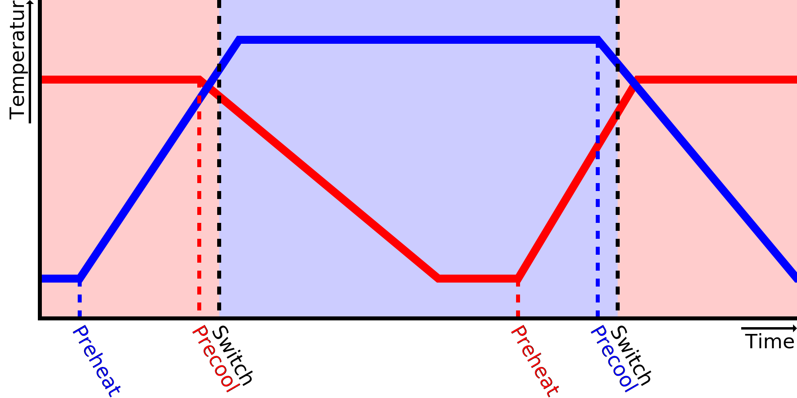

Temperatura de espera
====
Cura assume que impressoras com vários extrudeus têm bicos separados que podem ter temperaturas diferentes.Enquanto uma extrusora está ocupada, os outros bicos devem ser mantidos a uma temperatura mais baixa para impedir que o material na sala dos bicos se degradasse e exagere.Essa temperatura mais baixa é a temperatura de vigília.

Uma boa temperatura em espera é baixa o suficiente para proteger o filamento da degradação, que pode preencher o bico.É baixo o suficiente para impedir que o material escape do bico escorrendo.Mas também é alto o suficiente para que a impressão continue rapidamente quando as outras extrusoras terminarem.