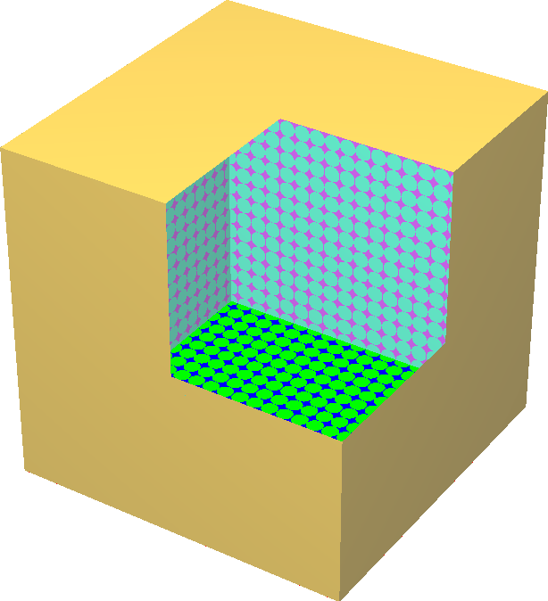
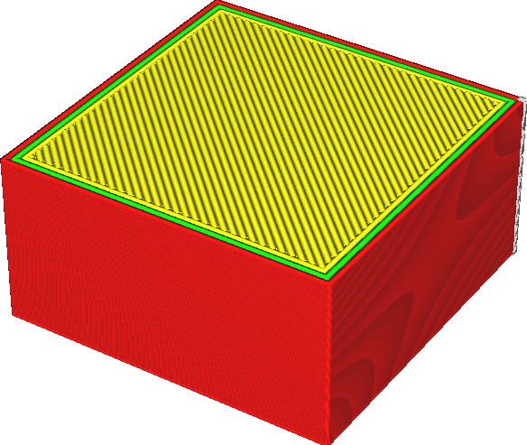
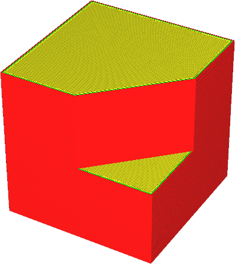

Mantenha os rostos disjuntos
====
Cura precisa saber onde o interior do seu modelo é preencher o volume com material.Se o modelo não for adequadamente à prova d'água, isso é ambíguo.Normalmente, o Cura não imprimirá as partes que não estão devidamente fechadas.

Se esse parâmetro for ativado, as camadas cujo perímetro não estiver devidamente fechado será mantido.O perímetro será fechado artificialmente com uma linha reta.Isso pode corrigir certos modelos que têm pequenos desvios na superfície.Mas isso também pode dar uma má interpretação do seu modelo.

A visualização de raio x mostrará as lacunas que podem ser preenchidas com esse ajuste vermelho.