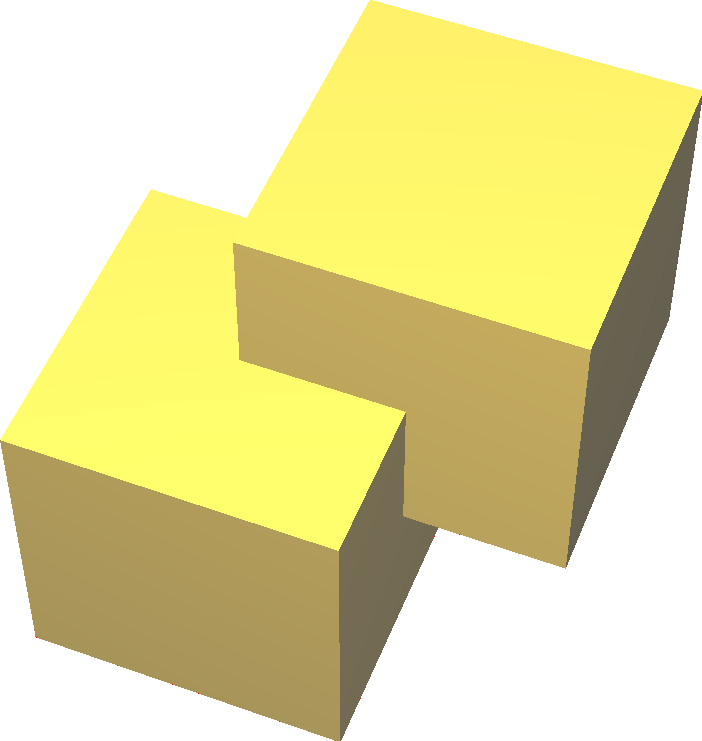
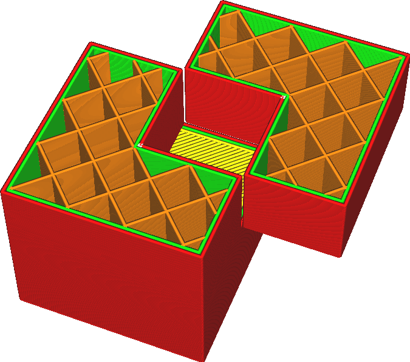

Junte -se aos volumes sobrepostos
====
Se um modelo contiver vários volumes que cruzam, o volume que está dentro dos dois volumes normalmente não será preenchido.Essa configuração significa que o Cura ignora as estruturas internas e está contente para preencher todas elas, independentemente do número de conchas ao redor do volume.

Em termos técnicos, esse ajuste modifica efetivamente a regra de [pares/ímpar](https://en.wikipedia.org/wiki/Even%E2%80%93ODD_Rule) para [diferente de zero](https://in. wikipedia.org/wiki/NonZero-RULE).Normalmente, um volume é preenchido se estiver cercado por um número ímpar de conchas.Quando esse parâmetro é ativado, ele é preenchido se estiver cercado por um número não zero de conchas.

*Isso funciona apenas para volumes do mesmo modelo.Se você carregou vários arquivos e os fez cruzar no Cura, esse parâmetro não terá efeito.Consulte o parâmetro Excluir a interseção de malhas para resolver os problemas sobrepostos de vários pontos separados.*