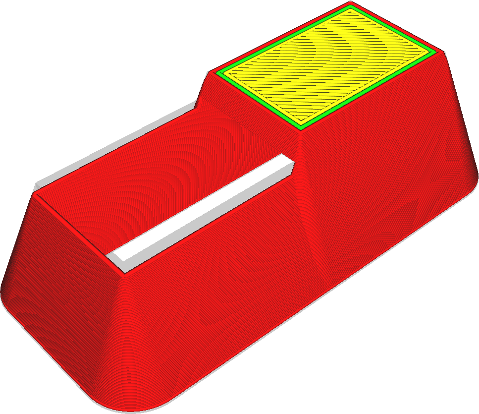
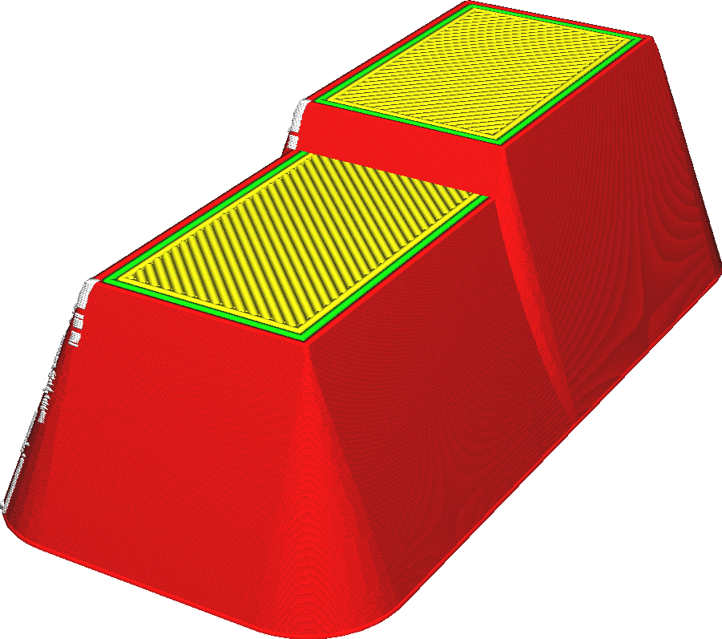

Exclua todos os buracos
====
Alguns modelos, em particular, os destinados a técnicas de fabricação, como moldagem por injeção, tendem a apresentar cavidades internas que não são visíveis.Se esse parâmetro for ativado, o Cura remove essas cavidades internas.

As cavidades interiores podem ser projetadas para salvar a matéria, mas com a impressão 3D, algumas restrições tornam esses modelos imprimindo menos bem.Por exemplo, as impressoras 3D não funcionam bem com paredes finas que não são um múltiplo da largura da linha, e a pele superior tende a cair se não for suportada pelo preenchimento.Geralmente é preferível fazer uma malha sólida e deixar o fatador decidir como preenchê -la.Esse parâmetro de fixação de malha permite que você faça isso sem precisar modificar a malha.

Cura apenas analisará horizontalmente se uma cavidade estiver completamente fechada.Ele não verá se uma cavidade está acessível de cima ou de baixo.A diferença sempre pode ser visível de cima ou de baixo.