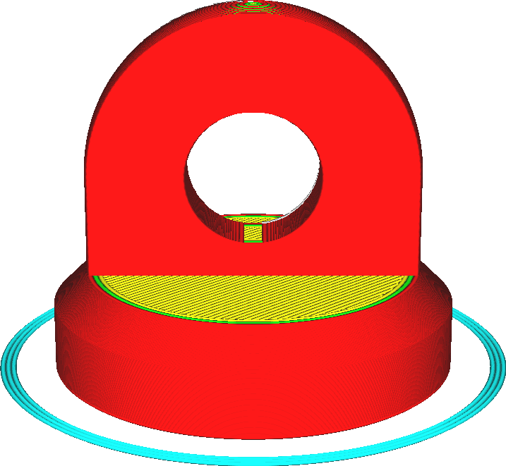

Tipo de adesão do platô
====
Existem três tipos de adesão aos conjuntos de impressão: a saia, a borda e a balsa.Você também pode desativar facilmente os tipos de adesão definindo o parâmetro em qualquer um.

Saia
----
Uma saia é uma linha simples que envolve sua marca.Não contribui diretamente para a adesão ao conjunto.No entanto, se você não deseja usar outros métodos de associação, esse método sempre possui duas funções.
* Ele permite que você inicie seu bico antes de iniciar a impressão do seu modelo real, a fim de garantir que o material flua corretamente.
* Permite que você veja se sua bandeja de impressão está nivelada corretamente ou não.

Fronteira
----
Uma borda é uma área plana com uma única camada ao redor da base do seu modelo.Seu objetivo é manter as bordas da sua impressão para baixo e aumentar a zona de contato entre a impressão e a bandeja de impressão.
* A maior superfície permite que sua pegada se junte melhor à bandeja de impressão.Isso é útil para praticamente todas as impressões de mais de alguns centímetros.
* Essa vantagem também permite que você mantenha as bordas da sua pegada baixa.Os materiais que encolhem muito o resfriamento (como os ABS) tendem a se deformar muito durante a impressão.Uma borda grande o suficiente mantém os cantos no lugar e evita isso -dendo -se.

Jangada
----
Uma jangada é uma placa grossa entre o modelo e a bandeja de impressão.Esta jangada protege sua marca do calor da bandeja de impressão.Também terá uma grande área para se juntar à bandeja.A impressão é colocada no topo desta balsa, onde pode aderir melhor.No entanto, cuidado com as impressões finas, pois pode ser difícil remover a balsa sem danificar a impressão.