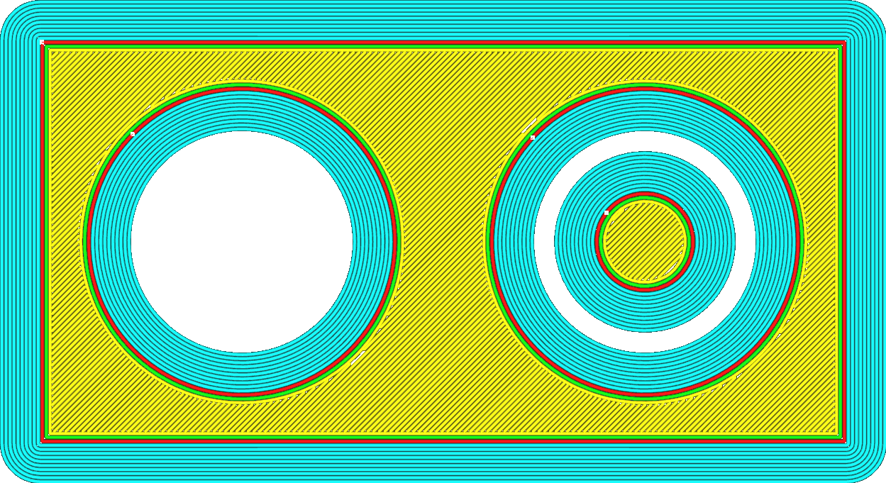

Fronteira apenas por fora
====
Se o seu modelo tiver orifícios na camada inicial da bandeja de impressão, esse ajuste impedirá a impressão de uma borda dentro do orifício.

A borda interna geralmente acrescenta muito pouca força de aderência adicional entre a impressão e a bandeja de impressão e não afeta a prevenção do estreitamento.A retirada da borda interna pode economizar tempo assim que a impressão terminar, porque você não precisará remover a borda dos orifícios internos.

** Se houver outro objeto dentro do buraco, a borda não pode ser removida devido a limitações técnicas. **