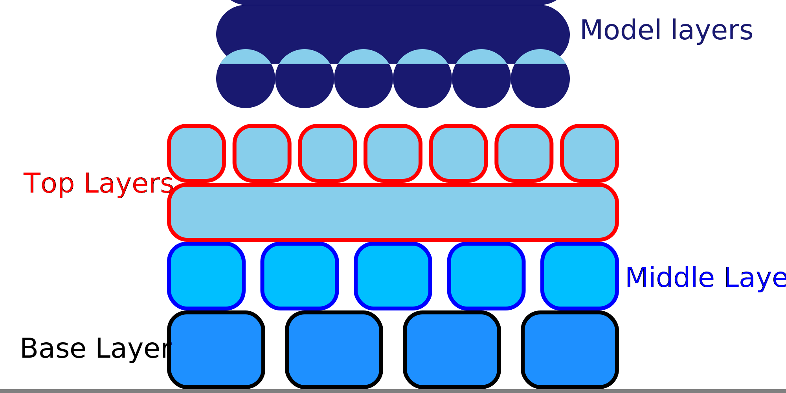

Meio da impressão da balsa
====
Esse ajuste configura a velocidade à qual o bico pode passar nos cantos enquanto a camada central da balsa é impressa.A taxa de choque durante a camada média da jangada pode ser configurada separadamente das camadas básicas e mais altas.

Como a balsa geralmente é composta de segmentos de longa linha, o aumento do choque normalmente tem muito pouco impacto no tempo de impressão.No entanto, o aumento da taxa de empurrões economiza um pouco de tempo durante a passagem nos cantos no final da linha.

Aumentar a taxa de choque fará com que a impressora vibre durante a impressão da camada central da balsa.Isso aumenta levemente o risco de descascar a balsa da bandeja de impressão.