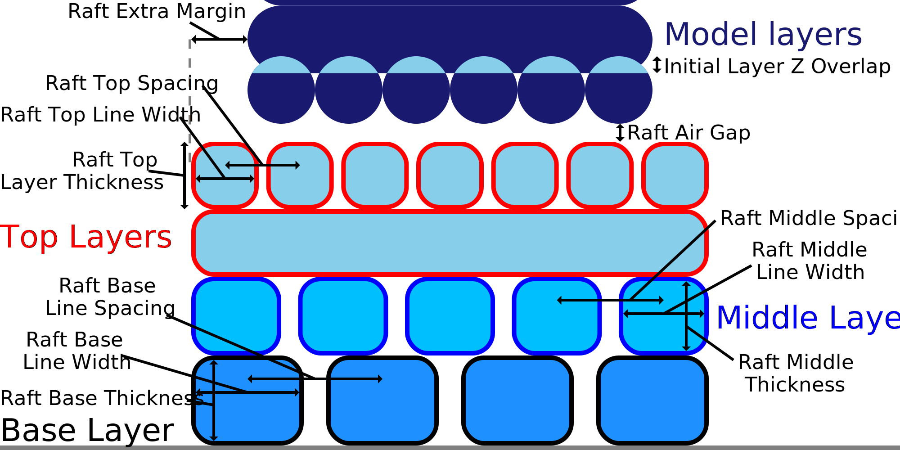

Largura da linha de jangada superior
====
Este parâmetro indica a largura das linhas das camadas superiores da jangada.

Para produzir uma superfície lisa para a jangada, as linhas das camadas superiores devem ser bastante finas e espaçadas de maneira fechada com o parâmetro [espaço da jangada superior](Raft_surface_line_spacing.md).As linhas finas produzem uma superfície mais suave que, por sua vez, produzirá uma face inferior mais suave da impressão e melhorará a aderência entre a jangada e a impressão.

No entanto, as melhores e pequenas linhas espaçadas também levam muito mais tempo para imprimir.Linhas finas também levam a uma subestimação, o que enfraquece a aderência entre a balsa e o modelo.