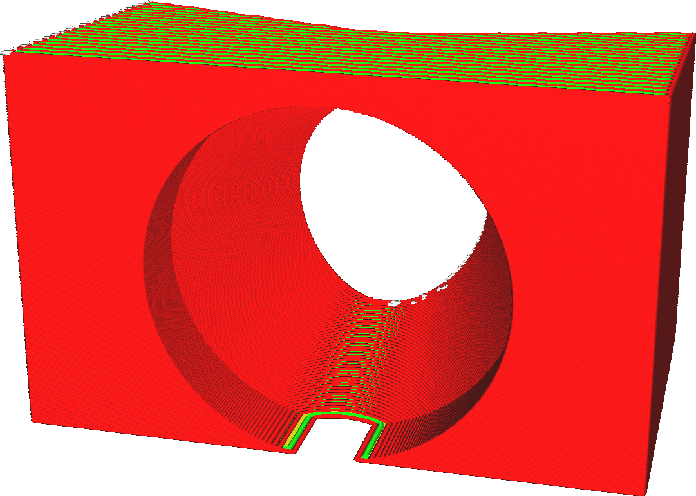

Altura da camada
====
A impressora 3D deposita plástico por camadas.A altura das camadas é a espessura dessas camadas em milímetros.É o fator mais importante tanto para a qualidade visual da sua impressão final quanto para o tempo de impressão.

A altura da camada é o parâmetro mais importante para afetar a qualidade geral e, inversamente, o tempo de impressão.Estes são apenas alguns dos efeitos:
* Camadas finas aumentam a qualidade visual da impressão.Como as camadas são mais finas, o efeito da escada nas bordas da camada será reduzido.Além disso, as camadas estarão mais próximas uma da outra e as dobras entre as camadas serão, portanto, menores, o que dará um acabamento mais suave em geral.
* Camadas finas permitem que a impressora produza mais detalhes nos lados superior e inferior da sua impressão.
* Ter camadas mais espessas tende a tornar a impressão mais forte, até um certo ponto.Haverá menos arestas entre as camadas, o que é um ponto fraco.As camadas mais grossas não cismam tanto.
* As camadas mais espessas reduzem o tempo de impressão, porque o bico não precisa fazer tantos movimentos horizontais.

Camadas de altura em comparação com perfis
----
Muitos parâmetros dependem da altura da camada.À medida que a altura da camada afeta consideravelmente o fluxo do material através do bico, muitos parâmetros do processo de impressão mudarão.Isso é muito complexo.Por exemplo, quando você aumenta a altura da camada, provavelmente deve aumentar ligeiramente a temperatura de impressão para compensar a taxa adicional de perda de calor.A temperatura afeta então a fluidez do material, o que terá um impacto na nitidez dos seus cantos e no resfriamento necessário, etc.É sempre aconselhável começar a partir de um perfil de qualidade pré-estabelecido, disponível para sua impressora, que tem uma altura de uma camada próxima ao que você deseja.

Você pode escolher a altura da camada desejada no modo personalizado, mas os perfis predefinidos também estão disponíveis com diferentes camadas.Você pode escolher perfis para diferentes camadas de camadas no modo recomendado usando um cursor ou usando a lista de suspensão no modo personalizado.Como esses perfis também modificam certos parâmetros que dependem da altura da camada, você provavelmente terá melhor qualidade dessa maneira.

Notas Adicionais
----
Em uma altura de camada muito baixa, você pode subir até o limite de resolução do eixo z. Verifique o tamanho do eixo z da sua impressora e verifique se a altura da camada é um múltiplo disso.Se eles não corresponderem, algumas camadas serão mais espessas que outras, o que causará bandas.

*Observe que a definição da altura das camadas não se aplica à camada de impressão inicial ou às camadas da balsa, que têm suas próprias configurações para ajustar a altura das camadas separadamente.Ao usar camadas adaptativas, esse parâmetro de altura da camada será usado como um valor básico, mas a altura real da camada terá uma certa variação.*

