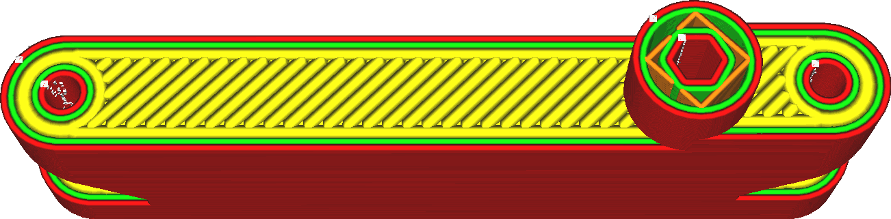

Linha superior/abaixo
====
Parâmetro usado para definir a largura de cada linha impressa alta e inferior.A largura de uma linha pode ser diferente do tamanho do bico simplesmente extrudando mais ou menos material do que o necessário.Se mais material for extrudado, o plástico fluirá em direção aos lados, o que tornará a linha mais espessa.Se menos material for extrudado, a tensão superficial da matéria tende a atrair o material em direção à linha central da trajetória do bico.

O alargamento das linhas da pele é uma maneira fácil de reduzir o tempo de impressão, pois menos linhas serão necessárias para imprimir as faces superior e inferior do objeto.No entanto, ao aumentar demais, existe o risco de causar grandes flutuações de extrusão.Isso resultará em uma subestimação ao imprimir a pele e uma superextrusão ao imprimir o que vem então, porque o fluxo através do bico não pode ser ajustado com rapidez suficiente.O aumento da largura da linha da pele também aumentará o risco de ver orifícios na superfície, o que não é bonito e impede o aperto do objeto.

A redução na largura das linhas da pele tende a produzir uma superfície superior mais bonita, mas a um alto custo no tempo de impressão.Muitas vezes, é mais eficaz usar uma técnica diferente como [alongamento](../top_bottom/ferroing_enabled.md) ou para ajustar apenas a [linha da camada externa da superfície superior](../top_bottom/telhado_line_width.md).