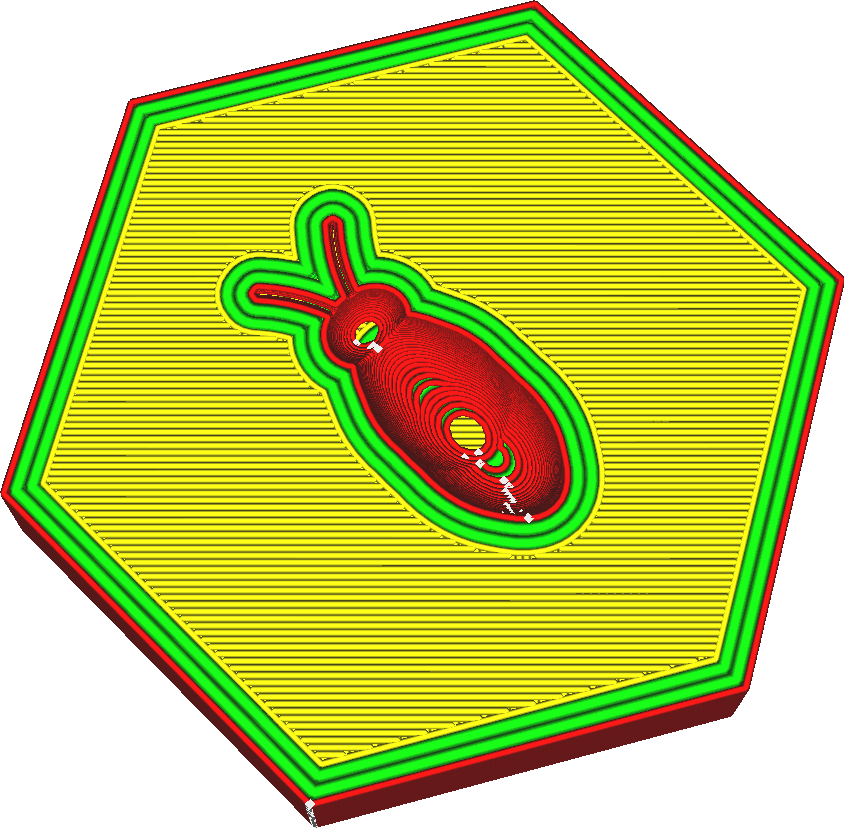

Largura da linha do (s) parede (s) interno (s)
====
A largura da linha de parede interior pode ser ajustada separadamente da parede externa.Esse ajuste indica a largura das linhas de cada parede interna.

A redução das paredes internas para uma largura de linha ligeiramente menor que o tamanho do bico é conhecido por ser benéfico para a resistência.O bico extrudará um pouco menos material, mas sua abertura se sobreporá as linhas das paredes adjacentes.O material é então empurrado pela parede anteriormente colocada em seu local correto.Mas isso também permite que o plástico se mostre melhor com as paredes adjacentes.Isso permite que as paredes se fundam melhor para que possam combinar sua força.Isso melhora consideravelmente a resistência das paredes.

Aumentar a linha da linha de parede interna pode reduzir o tempo de impressão.Você precisará de menos paredes internas para obter peças de resistência semelhantes.A resistência ainda será um pouco reduzida porque as paredes adjacentes não se fundirão tanto.

Ajuste da linha
----
Ao imprimir peças finas, ajustar a largura das linhas de parede é uma ferramenta importante para obter peças precisas e sólidas.A Cura nunca desenha apenas contornos completos; portanto, se um contorno não for adequado, um espaço cairá nas paredes, o que compromete bastante a solidez e a precisão da sala.

Cura tentará preencher essas lacunas entre as paredes se [preencher os orifícios entre as paredes](../shell/FILL_PERIMETER_GAPS.MD) for ativado, mas essa técnica é ideal para formas com espessuras arbitrárias e geralmente leva muita impressão tempo.Quando duas paredes se sobrepõem, a função [compensa para cavalos de parede](../shell/Travel_compense_overlapping_walls_nabled.md) reduz a largura da linha de parede para garantir que a parte seja dimensionalmente, mas isso causa alterações no fluxo qualidade e resistência da impressão.

Para um ajuste ideal, a sala deve ser um múltiplo exato da largura da linha de parede, para que as paredes se adaptem precisamente à sala.Se você conhece a largura do seu quarto, isso pode ser feito facilmente ajustando a largura das paredes.Você primeiro vê quanto contornos deseja ajustar para que as linhas ainda tenham uma largura razoável.Em seguida, você pode ver quanto precisa ajustar a largura das linhas das paredes para que as linhas se ajustem corretamente.Lembre -se de que você pode ajustar a [largura da linha da parede externa](Wall_Line_Width_0.md) e a [largura da linha da (s) parede (s) interna (s)](Wall_Line_Width_X.MD) separadamente.Corporativo O número de vezes que cada tipo de parede será desenhado para prever o efeito da modificação da largura da linha de parede.

O ajuste das linhas de parede é uma competência importante para a impressão 3D, que distingue especialistas em operadores de impressoras 3D de outras pessoas.Alguma prática é necessária.