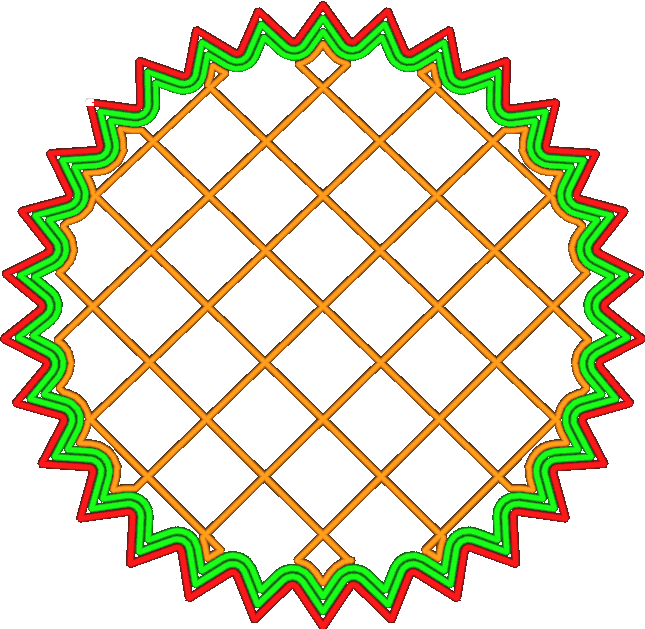

Paredes adicionais alternativas
====

Este parâmetro adiciona uma parede adicional uma camada em dois.Dessa forma, o recheio está preso verticalmente entre as paredes, o que dá impressões mais fortes.

Por exemplo, se você ajustar o número de linhas de parede com duas paredes e ativar a opção "alternar as paredes adicionais", duas paredes serão impressas nos pares e três paredes nas camadas ímpares.

A ativação deste parâmetro levará mais tempo, cerca de metade do que adicionaria uma parede adicional.De certa forma, essa parede adicional alternada é quase tão boa quanto uma parede adicional completa e, de outra maneira, não é:
* Aumenta consideravelmente a aderência entre recheio e paredes, pois as linhas de enchimento também podem aderir verticalmente à parede adicional acima e abaixo delas.Nesse sentido, a parede adicional é um grande ativo.É muito eficaz.
* Ele acrescenta à rigidez da impressão até metade de uma parede adicional.Ao se juntar à parede adjacente, ele distribui as restrições em um número maior de fios e oferece maior resistência às forças na direção horizontal.A parede adicional alternada não tem vantagem particular em fazer isso ou qualquer desvantagem específica.
* Uma parede adicional real também aumentaria a força de ligação das fraldas.As paredes são impressas lentamente, elas são, portanto, uma fonte importante de colocação de camadas.No entanto, a parede adicional alternada não se liga a camadas adjacentes porque ocorre apenas em duas camadas.

Portanto, a parede adicional alternada é uma maneira eficaz de adicionar rigidez horizontal, mas não uma maneira eficaz de adicionar resistência vertical.