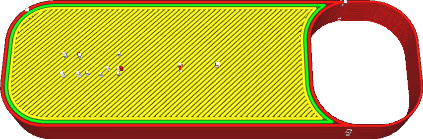

Imprima paredes finas
====
Normalmente, o Cura omite as paredes mais finas que a [largura da linha da parede externa](../Resolução/Wall_Line_Width_0.md), rejeitando -as como sendo pequenas demais para serem impressas.

Se esse parâmetro for ativado, o Cura ainda tentará imprimir essas peças.A impressão resultante será imprecisa e desordenada, mas deve produzir a forma desejada de uma maneira bastante confiável.

Os pequenos pedaços são preenchidos com linhas extremamente finas.Essas linhas são então combinadas se forem adjacentes entre si e não muito longas.Funciona em muitos casos, mas em alguns casos produz um pequeno zigue -zague, o que aumenta consideravelmente o tempo de impressão.

É aconselhável, antes de recorrer a esse ajuste, tentar ajustar ligeiramente a [largura da linha da parede externa](../Resolução/Wall_Line_Width_0.md).Se o seu quarto for um pouco mais fino que uma largura de linha, você poderá obter um resultado melhor se reduzir a largura da linha da parede externa para sua impressão completa, para que as peças finas sejam normalmente impressas.No entanto, se você reduzir demais a largura da linha, o material não fluirá de maneira confiável, o que resultará em uma subestimação.

** Isso apenas imprimirá as peças finas no plano horizontal.Para partes finas na direção z, consulte o ajuste [tolerância ao corte](../experimental/slice_tolerance.md) ou aumente a altura da camada. **