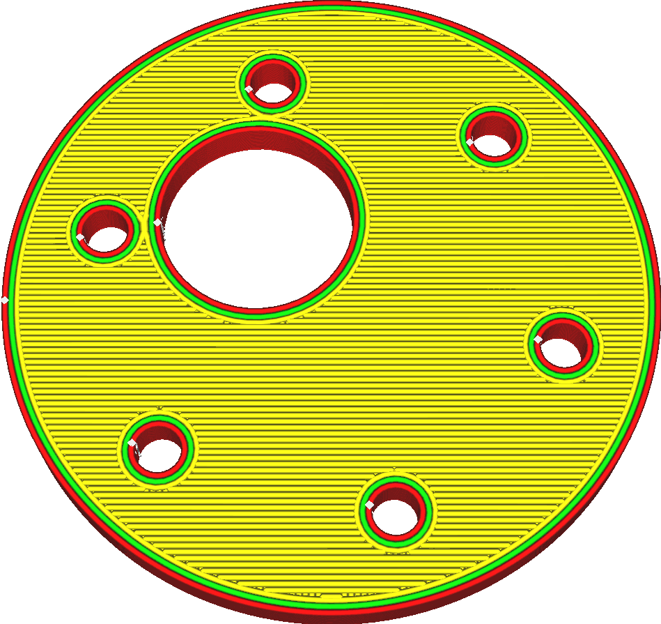
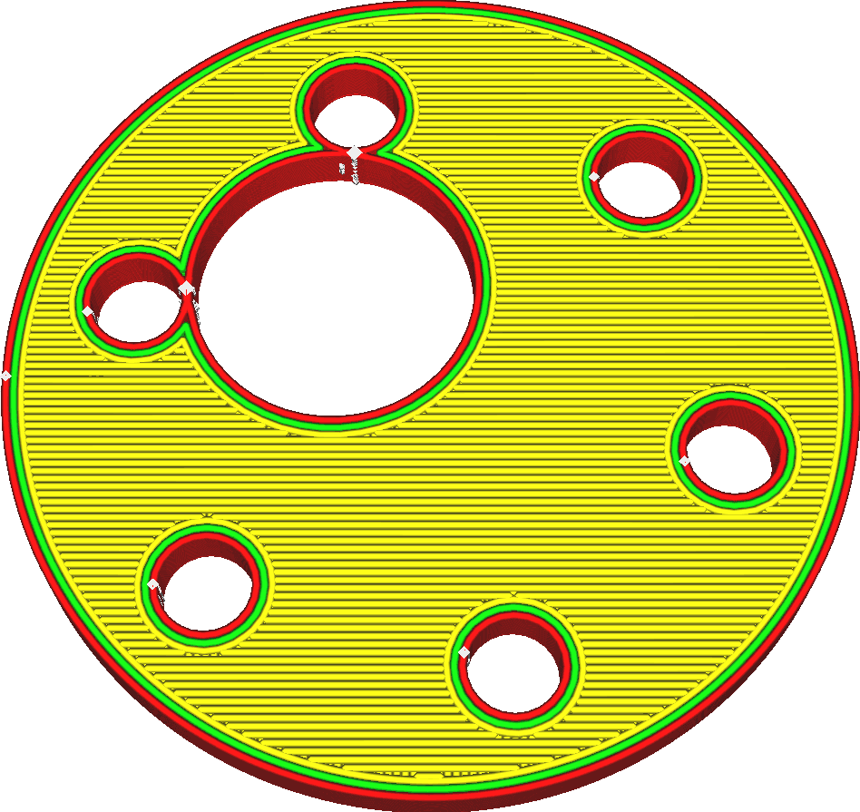

Expansão horizontal de buracos
====
Esta é uma medida de compensação no caso de os orifícios tendem a ser impressos menores do que o esperado.Graças a este parâmetro, você pode aumentar o tamanho dos orifícios verticais da sua impressão.Como no ajuste básico [expansão horizontal](xy_offset.md), os orifícios da sua impressão serão ampliados em todas as direções.

À medida que o orifício é estendido em todas as direções, o valor desse parâmetro realmente se aplica ao raio dos orifícios, e não ao seu diâmetro.

À medida que o orifício é estendido em todas as direções, o valor desse parâmetro realmente se aplica ao raio dos orifícios, e não ao seu diâmetro.

Devido à viscosidade do material, quando você imprime uma linha plástica em uma curva, o plástico tende a ser treinado com o bico na curva.Isso torna a curva um pouco menor que o esperado, porque o fio é puxado para dentro da curva.Normalmente, isso não é realmente visível, mas quando você imprime as peças que devem ser ajustadas exatamente exatamente ou quando você imprimir itens com orifícios verticais muito pequenos, torna -se prejudicial para a precisão da sua impressão.Os parafusos não se adaptam mais, as peças não se encaixam mais perfeitamente uma na outra e assim por diante.

Esse ajuste compensa isso aumentando um pouco todos os orifícios.Ao contrário de [expansão horizontal](xy_offset.md), esse ajuste afeta apenas os orifícios fechados.Se houver até uma pequena abertura de um lado (horizontalmente, na mesma camada), essa peça não será considerada um orifício e não será afetada por esse parâmetro.

Um valor positivo aumentará os orifícios.Um valor negativo tornará os orifícios menores.Quando combinados com a expansão horizontal, os orifícios são ampliados antes de aplicar a expansão horizontal comum.Isso pode levar ao desaparecimento total de peças finas antes que elas sejam ampliadas pela expansão horizontal comum.

Observe que este parâmetro leva apenas em consideração os orifícios no plano da camada.Ele ajusta apenas o tamanho dos orifícios na parte superior ou na parte inferior da impressão.Os orifícios localizados nas laterais da impressão não são ajustados.Além disso, não há restrição no tamanho ou forma do orifício.Qualquer cavidade que é completamente cercada por material nessa camada será expandida, até o interior de uma impressão oca.Além disso, isso significa que, assim que houver uma abertura no lado de tal forma, o interior não está mais completamente cercado por essas camadas e, portanto, não se expande.Isso geralmente resulta em uma borda visível dentro da impressão, exatamente na altura de uma abertura ao lado, onde o interior não está temporariamente dilatado por causa dessa abertura.