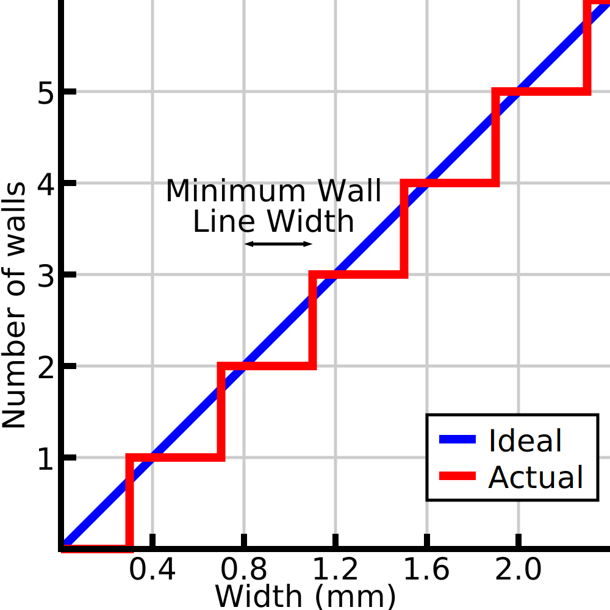

Largura mínima da linha de parede
====
Ao imprimir peças finas, o Cura ajusta a largura das linhas de parede para se adaptar à largura exata do modelo.Cura também pode decidir usar menos linhas de parede.Este parâmetro determina o limiar do qual a cura decide remover uma parede em vez de tornar as paredes existentes mais finas.

Números diferentes de cordões
----
Se houver apenas uma linha central e que o [número de distribuições das paredes](Wall_Distribution_Count.MD) está definido em 1, esse parâmetro funciona exatamente como diz.Se a linha central se tornar mais fina que uma certa largura, ela será removida em favor do aumento de outras linhas.Em outros casos, o cálculo é mais complexo.

O cálculo preciso desse valor é complexo, mas um entendimento intuitivo pode ser útil.De fato, você pode simplesmente dividir a largura total do modelo pela [largura da linha da parede](../Resolução/Wall_line_width.md) para obter um certo número de cabos.Pode ser uma fração (por exemplo: 5.3 larguras da linha de parede).A largura mínima da linha de parede leva apenas essa fração (largura de linha de 0,3) e adiciona um cabo adicional se exceder a largura mínima da linha de parede.O número de cordões sendo conhecidos, então determina a largura de cada uma das linhas de acordo com a conta de distribuição de cordões.

De fato, isso significa que, se várias linhas verem sua largura ajustada, a largura da linha nunca será tão extrema quanto a largura mínima da linha de parede permitiria.Por exemplo, se as duas linhas no meio forem ajustadas, a largura da linha não cairá abaixo da média da largura normal da linha e da largura mínima da linha de parede.

Este parâmetro pode ser definido separadamente para várias paredes [par](min_even_wall_line_width.md) e [impuro](min_odd_wall_line_width.md).O fato de não ter o cabo também é um caso separado, que pode ser definido usando o parâmetro [tamanho mínimo das entidades](min_feature_size.md).

Contexto
----
Em teoria, fixando esse valor em 50 % da largura da linha, garantimos que a largura da linha permaneça a mais próxima da largura da linha comum.No entanto, é melhor ficar um pouco acima desse valor.É mais fácil para uma impressora imprimir linhas mais amplas do que o tamanho do bico do que imprimir linhas mais finas e ter menos linhas também significa que a impressão será mais rápida.

Com materiais muito viscosos ou durante a impressão mais rápida, a largura mínima da linha de parede deve ser reduzida para evitar a criação de linhas muito grandes.Eles são difíceis de imprimir se o material não tiver tempo para fluir o suficiente nas laterais.Se a largura mínima da linha de parede for muito alta, as paredes não grudam bem, o que torna a impressão frágil.

** Este parâmetro não se aplica apenas às paredes normais, mas também a paredes de contorno adicionais, paredes de suporte, paredes de enchimento e padrões concêntricos. **