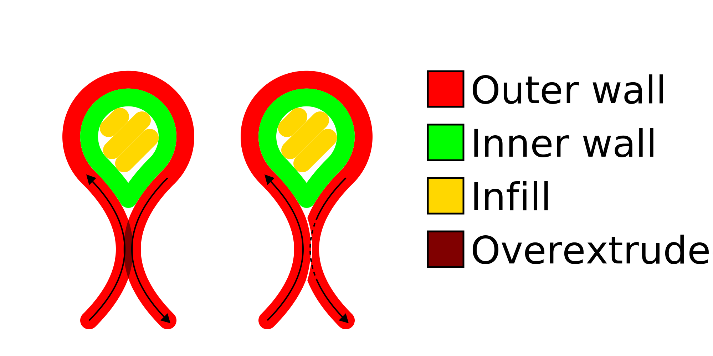

Compensar os cavalos de parede
====
Ao imprimir peças finas, as paredes opostas podem se aproximar o suficiente para se sobrepor.Ao imprimir as duas paredes com a largura normal da linha, elas excederiam.Esse ajuste evita essa superextrusão, reduzindo a largura de uma das linhas, o que torna possível evitar essa superextrusão e obter melhor precisão dimensional.

A largura da linha da parede que monta outra parede é reduzida pela área de sobreposição.Isso torna possível compensar a superextrusão.

Como descrito acima, essa característica tende a melhorar a precisão dimensional.No entanto, a desvantagem é que o fluxo se torna menos regular, o que leva a um subestimado em certos lugares e uma extrusão excessiva para outros.Além disso, o fluxo pode ser reduzido abaixo da velocidade mínima do bico e da extrusora, o que leva a um fluxo e contas irregulares.Para reduzir esse efeito, você pode definir o [fluxo mínimo da parede](Wall_min_flow.md) que transformará algumas das melhores paredes em movimentos translacionais em detrimento da precisão dimensional.

** Essa configuração tende a ser mais desordenada no modo de visão geral.Na impressão real, não há limites entre as linhas.A visão de visualização mostra apenas os caminhos do código G, mas, na realidade, o material é empurrado pela outra parede com a qual ele cavalga.Além disso, pequenas reduções de fluxo não serão perceptíveis na impressão real, porque o fluxo através do bico não pode ser ajustado tão rapidamente.Esses efeitos causam a impressão mais suave do que as visualizações de visualização são fornecidas. **

