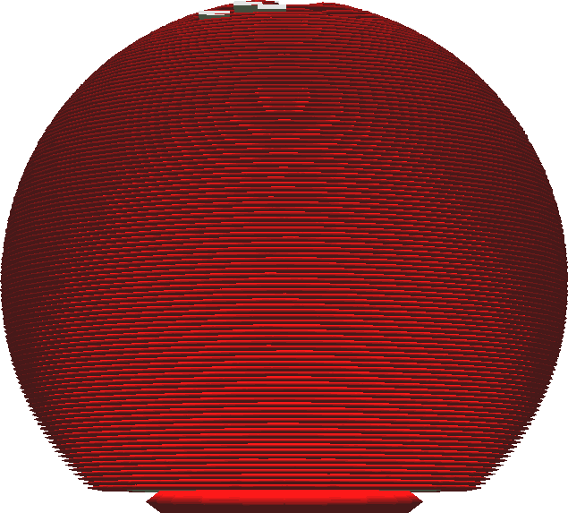

Expansão horizontal da camada inicial
====
Esse ajuste estende apenas a camada inicial que repousa na bandeja de impressão (ou na balsa).Assim como na [expansão horizontal](xy_offset.md), um valor positivo amplia a camada inicial enquanto um valor negativo o reduzirá.

A camada inicial é frequentemente impressa em uma bandeja aquecida, que a mantém em uma condição ligeiramente líquida, a fim de melhorar a adesão na bandeja de impressão.A camada inicial é normalmente muito mais espessa que o restante das camadas.Isso deixa tempo e matéria suficientes para a camada ceder lateralmente, criando um fenômeno chamado "pé de elefante", onde a parte inferior da impressão tem um lábio um pouco mais largo.Essa configuração pode compensar o pé de elefante, tornando com antecedência a camada inicial.Dê a este ajuste um pequeno valor negativo para compensar a pata do elefante.

Você também pode dar a este parâmetro um valor importante para criar um pseudo-cérebro em torno de sua pegada, que pode ser combinada com outras técnicas de associação, como a jangada.Lembre -se de que isso também resultará em uma expansão da parede, para que haja matéria sob as paredes da segunda camada.

** A combinação desse ajuste com uma borda é ineficaz, porque a borda produzirá uma faixa larga de qualquer maneira ao redor da camada inicial. **