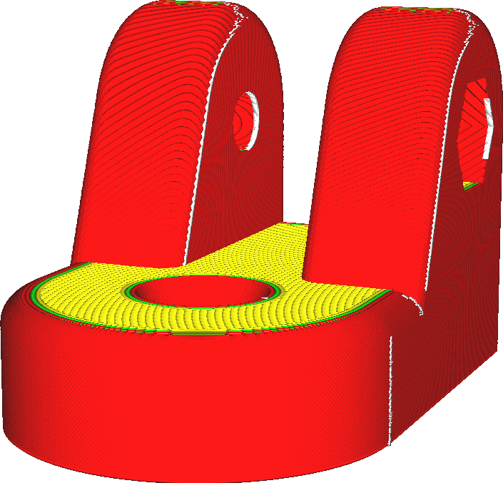

X junta em z
====
Se a localização da costura for definida em "especificado pelo usuário" no parâmetro [alinhamento da arco z em z](z_seam_type.md), a costura será colocada perto do local especificado com os parâmetros ** x junta na junta em z ** e [y junta em z](z_seam_y.md).

Este parâmetro indica uma posição absoluta na bandeja de impressão se [relacionada ao Z -Z](Z_seam_relative.md) for desativado, ou uma posição em relação ao centro do modelo se a opção [relacionada à jonta z](Z_seam_relative .md) é ativado.Quando a posição é absoluta, a coordenada está no sistema de coordenadas do código G, que é diferente das coordenadas que a cura indica para a colocação de objetos.

É útil escolher um local para costura que quase não é visível na aplicação da sua impressão.Se esse local não estiver disponível ou se um pós-processamento puder ser feito após a impressão, você pode optar por colocar a costura em um local onde ela pode ser facilmente cortada com uma faca ou lixada.