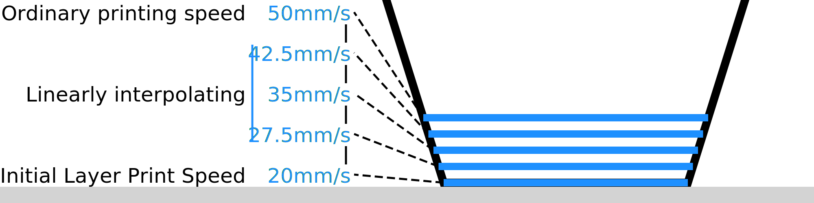

Número de fraldas mais lentas
====
A camada inicial não é a única camada que é mais lentamente impressa.Este parâmetro permite configurar o número de camadas que são impressas mais lentamente.Durante essas camadas, a velocidade de impressão aumenta gradualmente para a velocidade normal de impressão.

A partir da camada inicial, a velocidade aumenta (ou diminui) linearmente para a velocidade de impressão comum.Isso ocorre separadamente para as paredes, a pele, o recheio etc., se forem impressos em velocidades diferentes.

Há duas razões pelas quais você pode mudar para a velocidade normal de impressão em várias camadas.Primeiro de tudo, a segunda e a terceira camadas ainda estão bem próximas do conjunto de impressão e passar rapidamente acima deles pode rasgar a impressão com bastante facilidade.Segundo, a diferença no fluxo entre a velocidade de impressão da camada inicial e a velocidade de impressão comum pode ser tão grande que a grande variação de fluxo pode levar algum tempo para ocorrer.A transição lenta possibilita evitar a subestimação durante uma grande mudança de velocidade.

No entanto, uma transição lenta também estende a duração total da impressão.