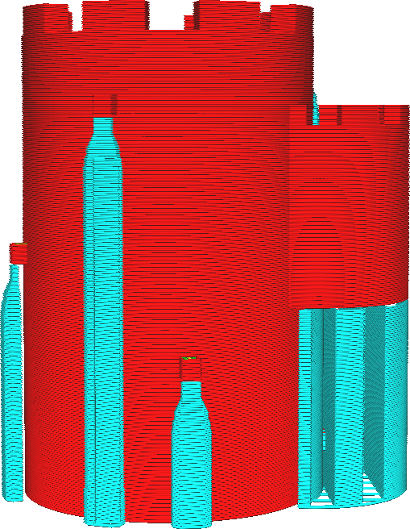
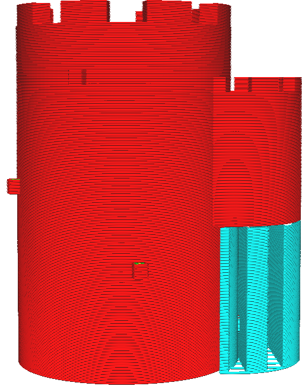
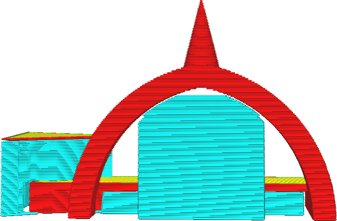

Superfície mínima de suporte
====
Este parâmetro requer um tamanho mínimo autorizado para suporte.Se um suporte tiver uma superfície menor que o valor desse parâmetro em uma determinada camada, o suporte será ignorado.

A razão de ser d'être deste parâmetro é que os pilares de suporte fino provavelmente mudarão.Eles também tendem a suportar pequenos elementos que provavelmente seriam bem impressos sem suporte.Se o suporte rochas, muitas falhas serão deixadas na impressão.Portanto, é preferível ignorar esses pilares de suporte fino.Esse ajuste possibilita filtrar o suporte pela seção transversal do pilar.

Ao aumentar a superfície, a quantidade de suporte impresso é reduzido, o que reduz ligeiramente o tempo e o uso do material.Mais importante, isso melhora a confiabilidade da impressão, porque há menos chances de que os pilares de suporte se inclinem.No entanto, isso também remove o suporte das pequenas características da sua impressão, para que a qualidade do transbordamento possa se deteriorar para essas peças.

Para algumas formas, isso pode ter o efeito colateral desagradável de remover a parte superior do suporte se a parte superior cair sob a área do limiar, mas não a parte inferior.Isso pode deixar peças sem data que você normalmente esperava ver suportado.

  

A ponta do arco não é suportada porque a área nessas camadas é muito pequena