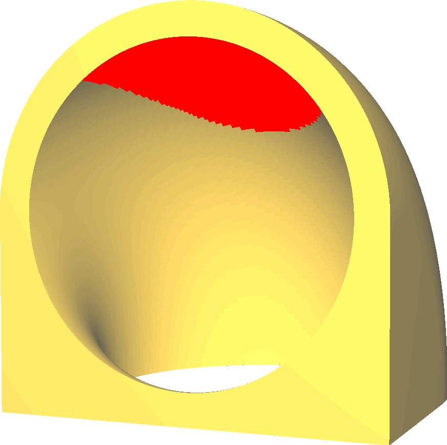

Gerar suportes
====
Impressoras 3D com fabricação de filamentos derretidos funcionam colocando um cordão plástico derretido nos lugares certos.Se este plástico não for sustentado, ele cairá, porque é empurrado para fora do bico com uma força importante e por causa da gravidade.A menos que o modelo esteja abaixo para suportar a nova camada, ele deve ser suportado por uma estrutura de suporte adicional, que será removida e jogada após o modelo.

Essa configuração possibilita criar estruturas de suporte para suportar o objeto durante a impressão.O Cura não ativará esse suporte padrão, mas marcará a superfície do modelo em vermelho se achar que o material lá poderá estar muito ocupado se o suporte não for ativado.

A impressão de um suporte leva muito tempo e material.Quando o suporte toca o modelo, ele deve ser quebrado ou cortado mais tarde, uma vez que a impressão termine.Isso tende a deixar uma cicatriz na superfície.

No entanto, o suporte às vezes é completamente necessário.Por exemplo, se o modelo tiver uma peça que aponte para a bandeja de impressão, esta peça se não simplesmente suspensa no ar.

Design para evitar suporte
----

Embora isso às vezes seja necessário, os suportes de impressão devem ser evitados o máximo possível.Existem muitas técnicas para evitar ter que imprimir um suporte.Esta é uma grande parte do design dos modelos para impressão 3D.Aqui estão algumas técnicas para modificar seu modelo 3D para evitar a necessidade de um suporte.
* Oriente seu modelo para que não haja superfícies altas mais altas que a bandeja de impressão.
* Evite o máximo possível para projetar saliências.
* Se houver uma superfície logo acima da bandeja de impressão, puxe -a para a bandeja de impressão.
* As bordas pequenas podem ser suportadas com uma inclinação de 45 graus, o que permite que a saliência seja transferida para o modelo.
* As maiores saliências podem ser cruzadas se forem suportadas de ambos os lados.O Cura guiará automaticamente as linhas no lado inferior dessa saliência para que elas passem em uma linha reta acima da ponte.Durante a impressão dessas linhas, o bico manterá a tensão no cordão para que não ceda.Isso então dá a ele tempo suficiente para solidificar para que ele possa se segurar por conta própria.
* Se houver um vácuo na saliência, uma ponte de sacrifício poderá ser projetada.Esta é uma camada na qual a violação está fechada.Isso permite que você construa uma boa ponte, para que a segunda camada possa construir as paredes apropriadas de espaço no topo.Após a impressão, a fenda pode ser aberta com uma faca, pois possui apenas uma camada de espessura.

