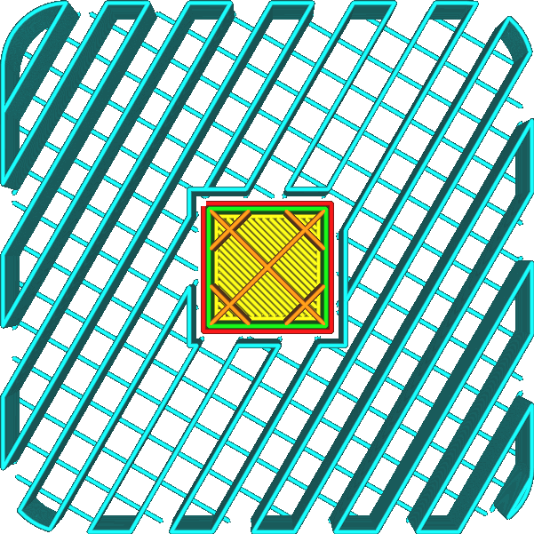

Suporte Linha de preenchimento
====
O modelo de suporte é normalmente orientado para que as linhas sejam perpendiculares à maioria das coisas que suporta.Dessa maneira, a distância que o material suportada deve cruzar é reduzida ao mínimo.Com esse ajuste, a orientação das linhas de suporte pode ser personalizada.

Se as [direções da linha superior/inferior](../top_bottom/skin_angles.md) forem ajustadas, é aconselhável ajustar o ângulo do suporte de acordo, de modo que seja sempre perpendicular às linhas da face inferior de impressão.Isso permite que esses resultados descansem corretamente no suporte, em vez de cair entre as linhas do suporte.Isso é particularmente importante para linhas e ziguezague [Motif de suporte](support_pattern.md), onde existem linhas retas longas entre as linhas de suporte que não oferecem suporte.

<!-se Cura_version> = 4.3->
** Em Cura 4.3, este parâmetro foi excluído em favor de [linhas de suporte do suporte do suporte](support_infill_angles.md). **
<!-endif->