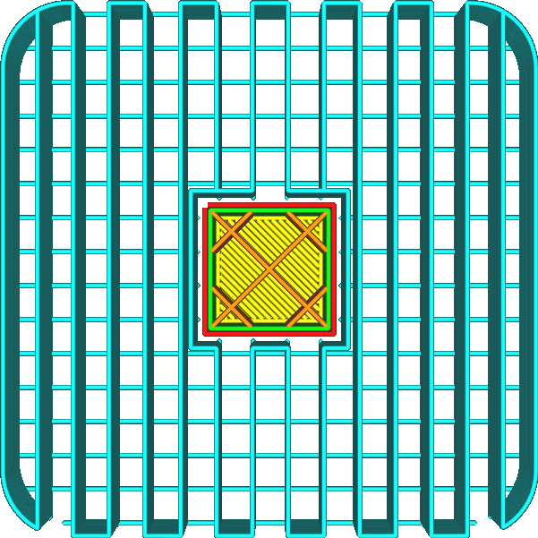
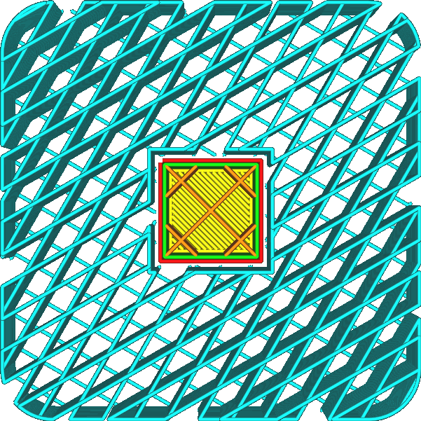

Suporte Linha de preenchimento
====
O modelo de suporte é normalmente orientado para que as linhas sejam perpendiculares à maioria das coisas que suporta.Dessa maneira, a distância que o material suportada deve cruzar é reduzida ao mínimo.Com esse ajuste, a orientação das linhas de suporte pode ser personalizada.

Se os [sentidos da linha superior/abaixo](../top_bottom/skin_angles.md) foram ajustados, é aconselhável ajustar o ângulo do suporte de acordo, de modo que seja sempre perpendicular às linhas da parte inferior do a impressão.Isso permite que esses resultados descansem corretamente no suporte, em vez de cair entre as linhas do suporte.Isso é particularmente importante para as linhas e ziguezague do [Motificação de Suporte](support_pattern.md), onde existem linhas retas longas entre as linhas de suporte que não oferecem suporte.

<!-se Cura_version> = 4.1->
** Este parâmetro possibilita a entrada de vários ângulos, que alternam de maneira semelhante ao parâmetro [direção da linha de enchimento](../preenchimento/refill_angles.md). **
<!-endif->