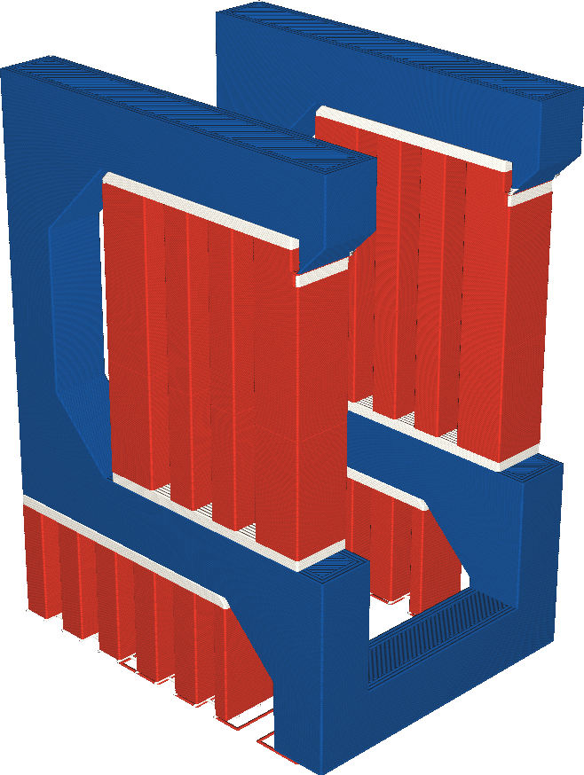

Apoiar a extrusora de preenchimento
====
Se sua impressora tiver várias extrusoras, o corpo principal do suporte poderá ser impresso com uma extrusora diferente da interface de suporte.Este parâmetro permite escolher qual extrusora é usada para o corpo principal do suporte.

Alguns materiais são mais adequados do que outros para a mídia de impressão, mas esses materiais também podem ser mais caros ou mais lentos para imprimir.Imprima apenas a interface com material caro, mas a maior parte do corpo com material mais barato pode economizar muito tempo e dinheiro.A interface sempre será impressa com o material caro, para que a parte que toque o modelo pareça boa ou seja mais fácil de desapegar, mas a maior parte do suporte será impressa com materiais mais baratos.

Se você usar materiais solúveis para imprimir a interface do suporte, mas materiais insolúveis para imprimir o corpo do suporte, lembre -se de que o corpo pode não ser capaz de ser removido das cavidades se for fisicamente impossível mover o corpo de suporte por uma pequena abertura.Onde normalmente um material solúvel pode fluir através de uma solução em solução, os materiais insolúveis podem não ser capazes de passar.