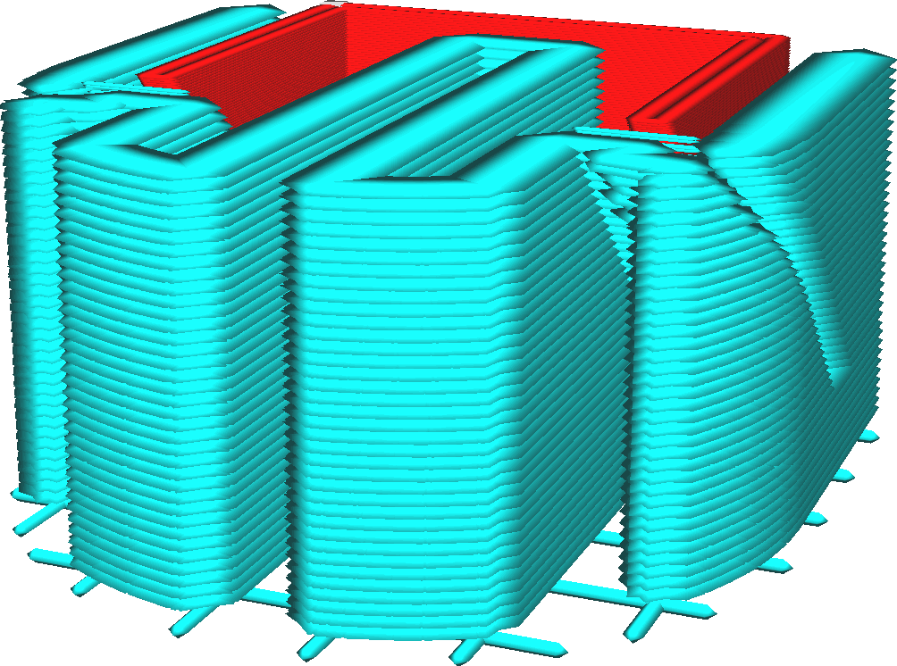

Espessura da camada de preenchimento de suporte
====
A qualidade visual e a resolução do suporte não são importantes, você pode usar camadas mais espessas para o suporte para reduzir o tempo de impressão.Este parâmetro permite que a espessura das camadas seja configurada com a qual o suporte será impresso.

Em vista por camadas, será preso que as linhas de suporte se tornassem muito mais amplas.Quando são impressos, as linhas de suporte descem mais em vez de expandir horizontalmente.

A espessura da camada de enchimento do suporte deve ser um múltiplo da altura da camada comum.Caso contrário, será arredondado para a camada mais próxima.

Esse ajuste não se aplica ao telhado ou ao piso do suporte, mas apenas à estrutura principal do suporte.

Essa configuração é particularmente útil quando o suporte é impresso com um material diferente do restante da impressão e ainda mais quando esse material é difícil de extrudar, como o PVA.Como o suporte não é extrudado em cada camada, a impressora não precisará alterar a extrusora com tanta frequência, o que economiza muito tempo.Como mais material é extrudado nas camadas impressas, os materiais que levam algum tempo para iniciar o fluxo serão impressos de maneira mais confiável.

Cuidado para não aumentar muito esse fluxo.Ao alterar o suporte, o fluxo através do bico deve ser acelerado e desacelerado significativamente.Pode haver algum atraso nesse ponto, para que o fluxo seja muito baixo no início do suporte e muito grande após o final do suporte.