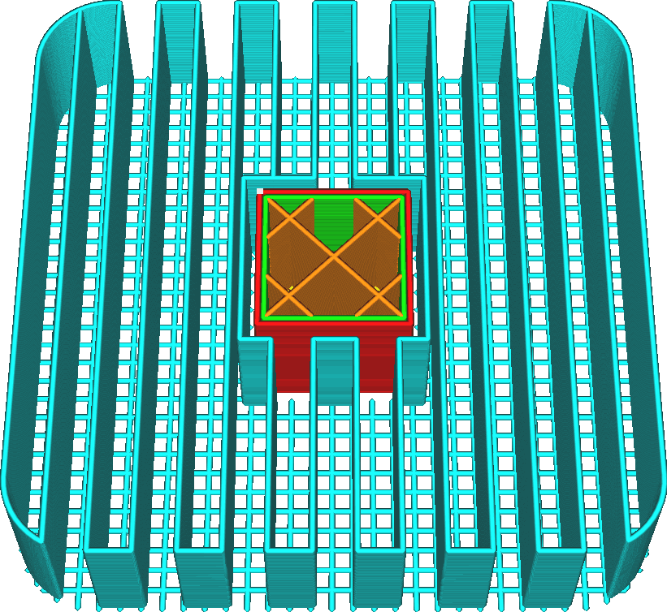

Distância do espaçamento de linha do suporte inicial da camada
====
A densidade do motivo impressa na primeira camada do suporte pode ser ajustada separadamente da densidade do restante do suporte.Essa configuração permite configurar a distância entre duas linhas adjacentes, onde o suporte repousa na bandeja de impressão.

Esse ajuste é útil para melhorar a adesão entre o suporte e a bandeja de impressão.Ao fazer o motivo do denso suporte na primeira camada, a superfície de contato é aumentada entre o suporte e a bandeja de impressão, o que melhora a adesão.As seguintes camadas podem ser colocadas em um material ao qual aderem melhor.

Como essa configuração afeta apenas a primeira camada, ela não tem um impacto significativo na resistência do suporte, nem no tempo e custo dos materiais.Também não afeta a qualidade das saliências.Para ajustar a densidade do suporte próximo às saliências, consulte o parâmetro [distância do espaçamento de linha do teto de suporte](support_roof_line_distance.md).

É aconselhável ajustar esse parâmetro em um múltiplo da distância entre as linhas do corpo principal do suporte.Dessa forma, as linhas de suporte corresponderão às linhas da primeira camada, o que permitirá que elas repousem na primeira camada em vez de flutuar no ar.