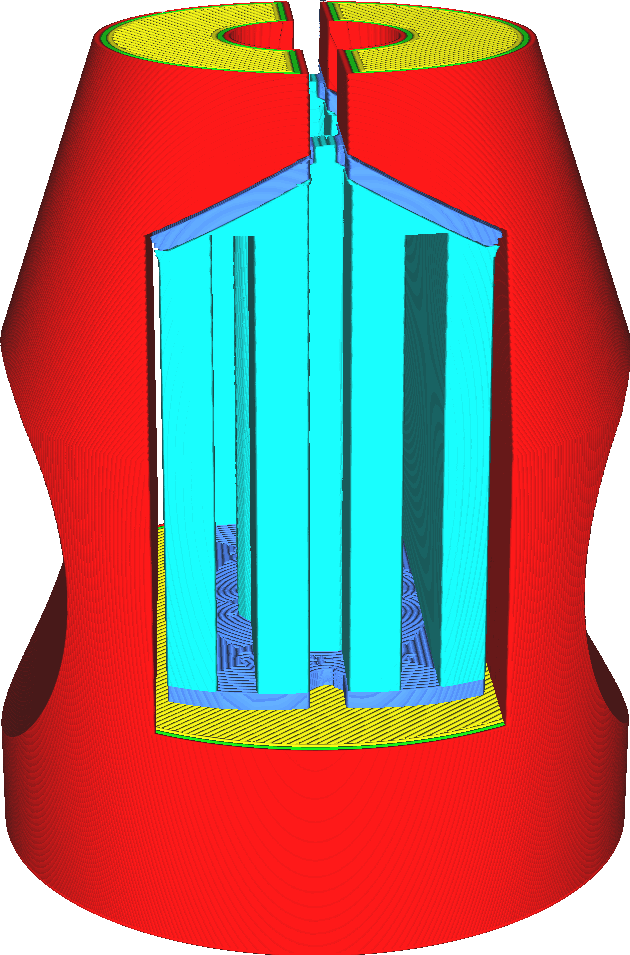

Distância de apoio aos suportes
====
Os suportes finos geralmente não são desejáveis.Eles tendem a mudar, o que pode arruinar a impressão.Quando várias peças de suporte são adjacentes, elas podem ser montadas para formar uma única peça de suporte muito mais sólida.

A montagem de peças de suporte torna o suporte mais sólido e confiável.Isso também tende a reduzir o tempo de impressão, dependendo do padrão.Muitos padrões requerem a impressão de uma parede adicional em todo o perímetro ou parte do perímetro, e a montagem de duas partes de suporte reduz esse perímetro.

Se esse parâmetro for aumentado demais, podemos montar peças de suporte muito distantes uma da outra.Isso pode aumentar o tempo de impressão e o uso do material.