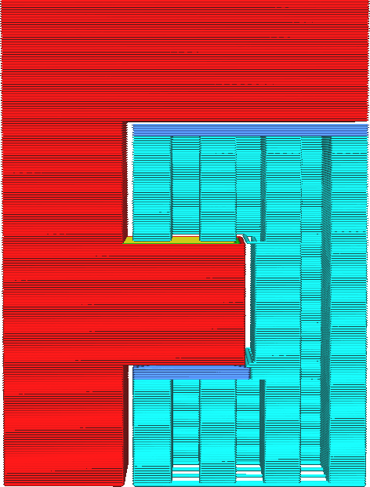

Ative os tetos de suporte
====
O teto de suporte é uma estrutura intermediária entre o suporte e o modelo em que o modelo é baseado no suporte.Ele pode ser usado para fornecer suporte maior ou melhor para o modelo sem ter um impacto significativo no tempo de impressão.O teto de suporte geralmente é impresso mais ou menos rapidamente.

Por padrão, o teto de suporte é mais denso que o suporte normal.Isso possibilita obter uma excesso de melhor qualidade, pois o modelo não precisa atravessar grandes distâncias.No entanto, será muito mais difícil remover o suporte.

O teto de suporte também pode ser impresso com uma extrusora diferente do restante do suporte.Certos materiais destinados à impressão do suporte podem ser muito caros e lentos para imprimir.Assim, a maior parte do suporte é sempre impressa com o material mais barato ou mais rápido, mas o teto em que o uso do material de suporte é implementado é impresso com o material mais sofisticado.