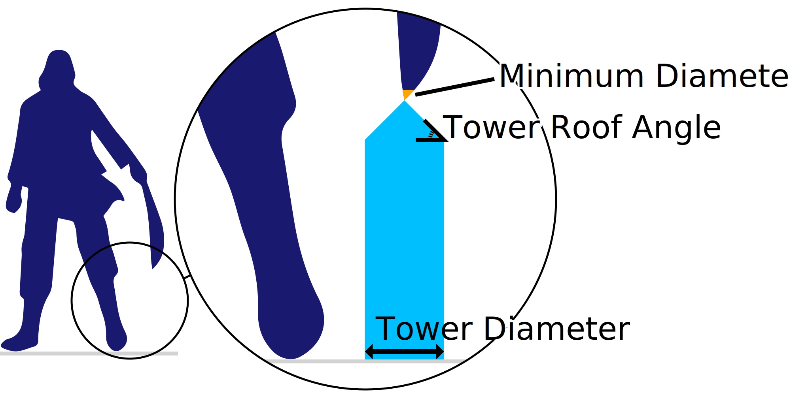

Diâmetro da torre
====
Certas peças que suportam o modelo são muito pequenas.O apoio que seria gerado entraria em colapso facilmente.Em vez disso, o Cura gera truques para essas peças mais largas, para que elas não entrem em colapso.

Essa configuração permite configurar a largura dessas torres.

As torres mais amplas levam um pouco mais de tempo para imprimir e consumir mais material, mas também tornam o suporte mais sólido, o que melhora a confiabilidade da impressão.