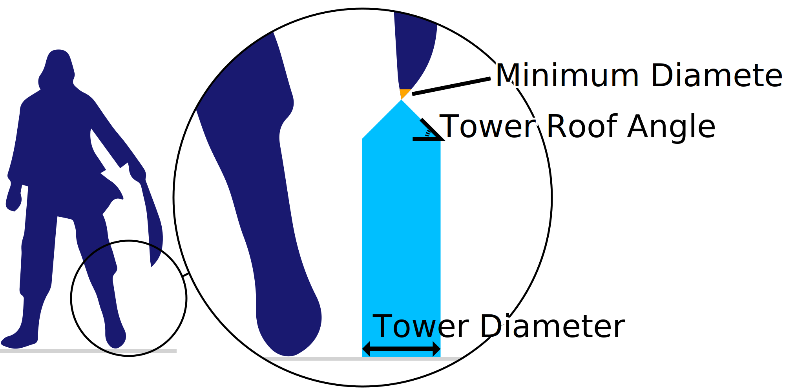

Ângulo do telhado da torre
====
As torres de apoio têm um cume nítido, que torna a transição entre o pilar mais amplo da torre e a zona estreita de saliência que deve ser realmente sustentada.

Um valor mais alto significa que as torres de suporte têm um teto muito nítido.A torre começa a reduzir sua largura ligeiramente menor, o que reduz a estabilidade da torre, mas economiza material e tempo de impressão.

Um valor mais baixo fez com que as voltas de suporte tenham um teto mais plano.