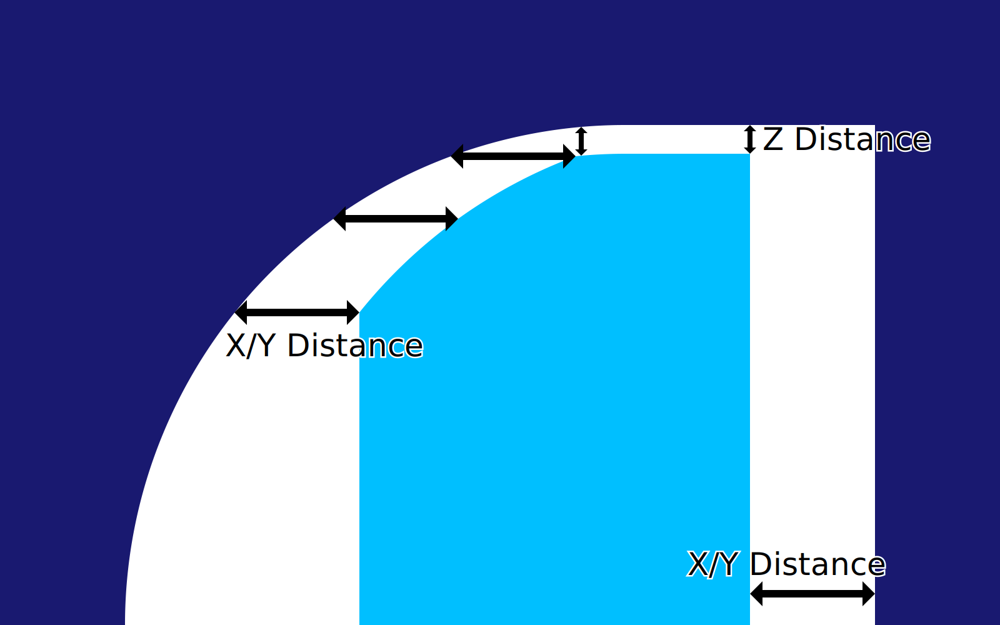
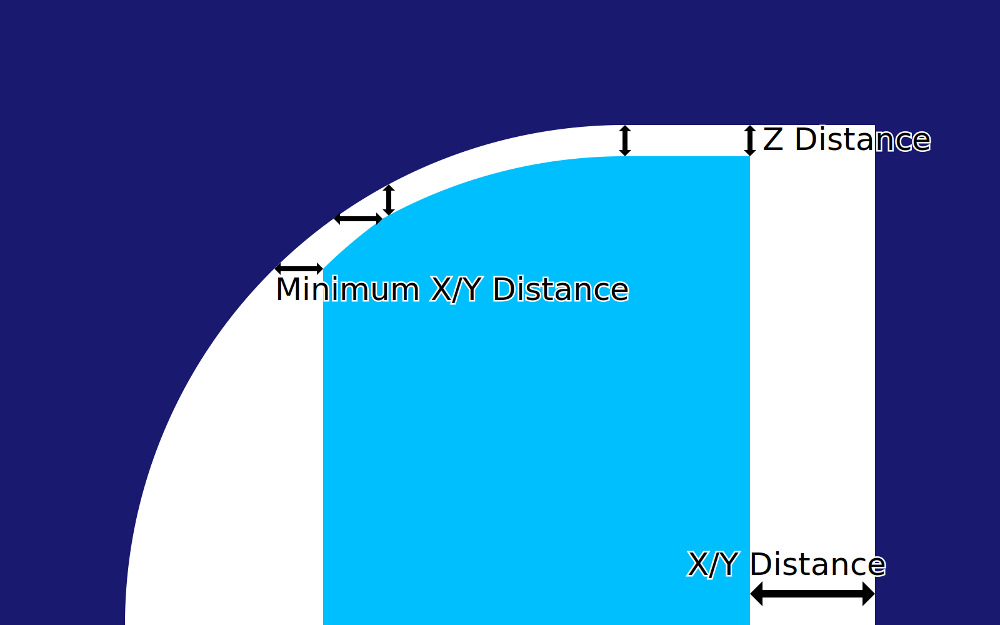

Distância X/Y suporta
====
Isso indica a distância horizontal a ser observada entre o suporte e o modelo.

O objetivo da distância horizontal é impedir que o suporte atinja o modelo, onde deixaria uma cicatriz na superfície.No entanto, isso também cria uma distância maior entre o modelo e a estrutura de suporte onde está a saliência, o que deixa pequenas saliência não sustentada.

Distância x/y comparada a z
----
A distância x/y e a distância z devem ser respeitadas exatamente;nem mais nem menos.Como é uma superlotação, deve haver uma preferência entre os dois.Isso é indicado pelo parâmetro [prioridade da distância dos suportes](support_xy_overrides_z.md).Este parâmetro modifica o comportamento deste parâmetro de distância de suporte X/Y.

Se X/Y tiver uma prioridade em Z, a distância x/y será mantida, mesmo que isso signifique que a distância z é muito grande.A distância z é sempre mantida como mínima.

Se Z tiver prioridade em x/y, a distância z é mantida, mesmo que isso signifique que a distância x/y é muito baixa.A distância x/y então tem alguma influência do topo do suporte, onde a distância z não tem influência.