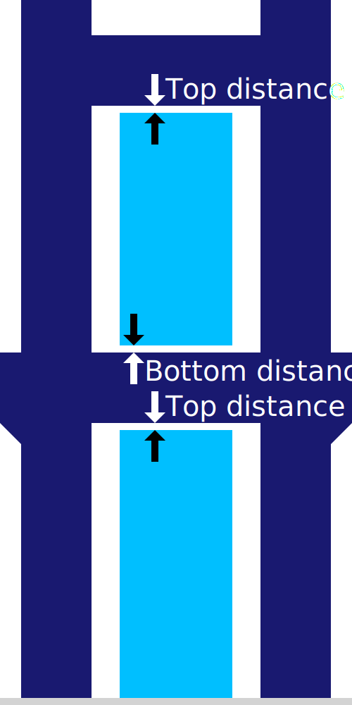

Distância z de suportes
====
Esse ajuste indica a distância vertical que deve ser mantida entre o suporte e o modelo, ambos na parte superior do suporte.

Essa estrutura é o fator mais influente, na medida em que o suporte adere ao modelo.

Se esse parâmetro for reduzido, o suporte aderirá melhor ao modelo.Os negros têm uma aparência melhor, pois não têm permissão para ceder tanto.Isso também melhorará a estabilidade do suporte, pois está firmemente posicionado no modelo, no lado inferior do suporte.

Se essa configuração for aumentada, o suporte será mais fácil de remover.Não deixará tanta cicatriz na superfície em que o suporte suporta o modelo.Por outro lado, o modelo também não será suportado.Isso reduz a qualidade da superfície das saliências.

Como regra, quanto mais o material de suporte adere bem ao material de construção, mais importante essa configuração deve ser.Se você usar um material diferente para imprimir o suporte, a distância Z poderá ser consideravelmente reduzida, porque dois materiais diferentes tendem a se separar mais facilmente após a solidificação.Se você usar um material com boa adesão de camadas, precisará aumentar um pouco a configuração.A impressão quente ou com linhas mais espessas também aumenta a adesão e, portanto, também requer aumentar essa configuração.