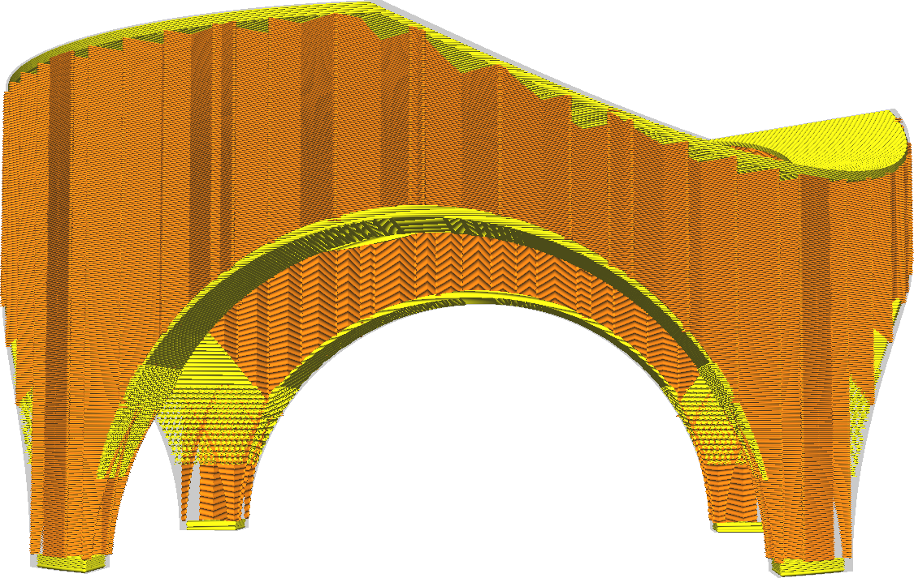
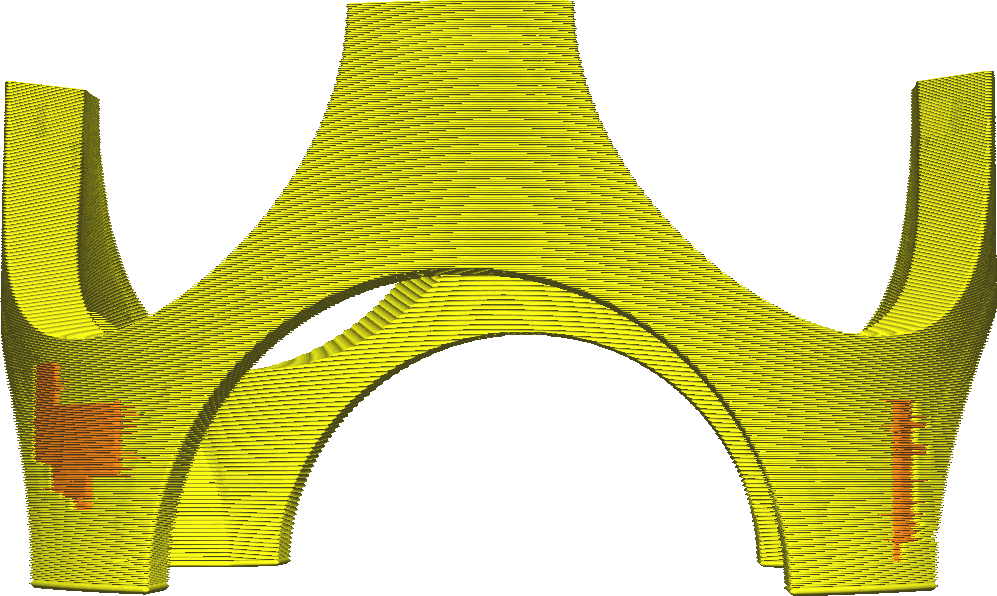

Expansão da distância da camada externa
====
Expanda ou reduza as camadas completas na parte superior e inferior da sua impressão na direção horizontal.Normalmente, as camadas completas são geradas apenas nas partes em que há um vácuo acima ou abaixo, mas com esse ajuste, você pode ampliá -lo um pouco mais, o que melhora a resistência ao garantir que a pele esteja melhor presa às paredes adjacentes e fechando os interstícios da pele.

* Se você tiver pequenos orifícios nas camadas superior ou inferior da impressão (orifícios preenchidos com o padrão de enchimento), ajustar esse parâmetro ligeiramente mais alto os fechará.Isso permite que a impressora imprima continuamente os linhas inferiores, o que melhora consideravelmente a resistência.
* Se o seu modelo tiver uma superfície horizontal ao lado de uma parede íngreme, aumentar esse ajuste pode melhorar a adesão entre as paredes da superfície íngreme e a pele, porque a pele será impressa diretamente em contato com essas paredes.
* Se você ajustar esse parâmetro em um valor negativo, a largura da camada superior e inferior será reduzida e substituída pelo preenchimento.Isso pode economizar tempo de impressão, às custas da resistência.

** Devido a limitações técnicas, você não pode reduzir esse parâmetro abaixo do valor da [largura de remoção da camada externa](skin_preshrink.md).Aumente o parâmetro de largura de remoção da pele para remover mais pele. **