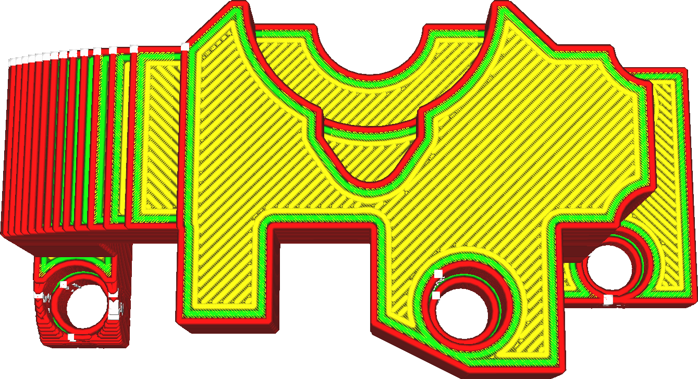

Alongamento
====
Esse ajuste modifica o espaço entre cada linha de ferro.As linhas de ferro são normalmente muito mais próximas do que as próprias linhas de impressão, o que contribui muito para sua eficácia.

* O aumento da linha reduzirá o tempo de impressão.
* No entanto, a redução da linha melhorará a qualidade da superfície superior.