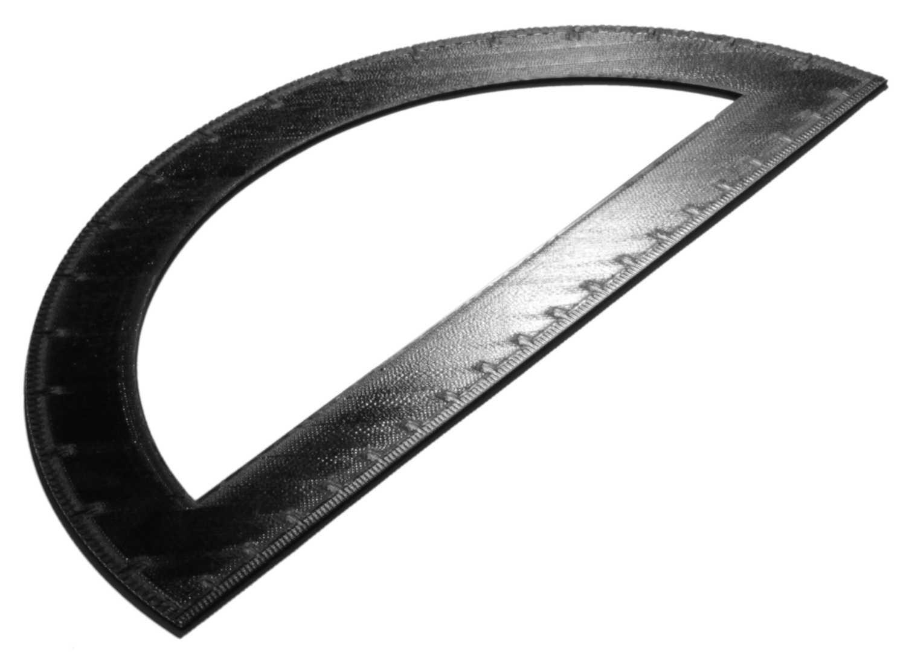

Ordem monótona acima/abaixo
====
Normalmente, o Cura ordena as linhas acima/abaixo para que a distância de deslocamento entre elas seja baixa.Se esse parâmetro for ativado, ele solicitará as linhas acima/abaixo para que as linhas adjacentes sejam sempre impressas por sobrepostas na mesma direção.

Ao imprimir as linhas acima/abaixo, elas geralmente se sobrepõem às linhas vizinhas, porque a forma de uma linha não é um retângulo perfeito.Essa sobreposição dá às linhas uma ligeira inclinação, o que significa que elas refletem a luz de maneira diferente em direções diferentes.Se as linhas adjacentes se sobreporem de maneira diferente, essa reflexão mudará.Você pode vê -lo no resultado final.Dá a diferentes áreas da superfície um brilho diferente.A impressão em uma ordem monótona garante que a sobreposição seja a mesma em toda a superfície, para que não haja diferença na maneira como reflete a luz.A superfície, portanto, parece mais homogênea e suave.

A ordem monótona aumenta ligeiramente o comprimento dos movimentos, mas esse efeito é muito mínimo.Tem apenas um efeito visual na impressão.A ordem monótona não tem vantagem mecânica.

Para obter uma superfície lisa, considere combinar este parâmetro com o parâmetro [Detours Mode](../Travel/Retaction_Combing.md) para evitar skins e talvez ativar a [altura do z-z](../travel/retraction_hop.md ).Você também pode ativar [Alongamento](ferroing_abled.md), mas isso cancela completamente a utilidade desse parâmetro.O alongamento tem sua própria [opção monótona](ferroing_monotonic.md).

Com uma ordem monótona, o brilho é o mesmo em todos os lugares.