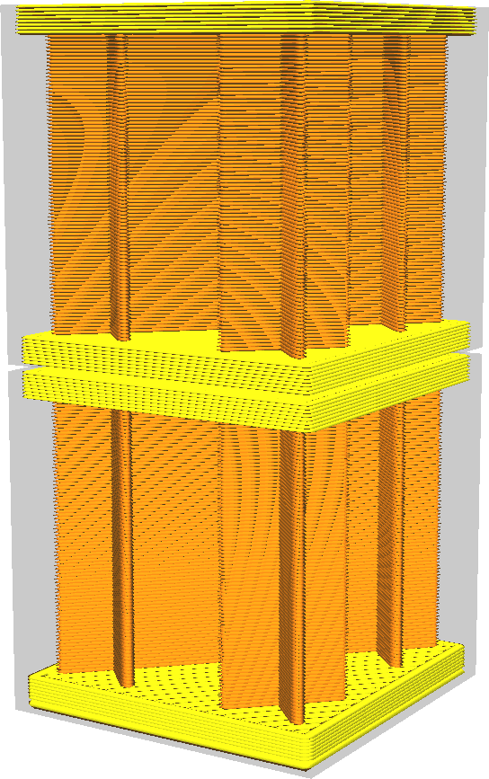
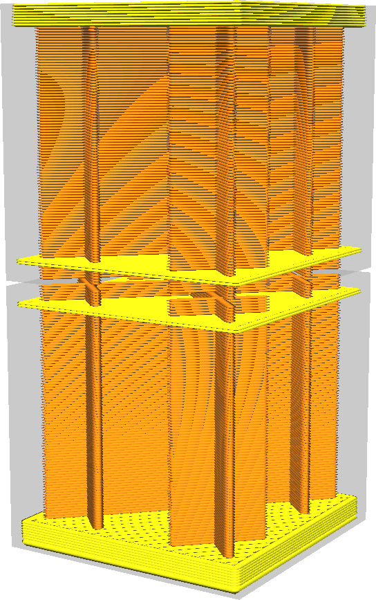

Nenhuma camada nos zuros z
====
Se o seu modelo tiver uma pequena fenda horizontal, menor que a espessura da pele, a partir da parte superior e inferior, esse ajuste não se preocupa em encher completamente a pele e a parte inferior acima/abaixo.Isso economiza tempo de corte e impressão, mas corre o risco de expor o preenchimento do ar.

O principal objetivo dessa configuração é reduzir o tempo de corte.Esse ajuste reduz efetivamente a resolução com a qual as cura levam amostras de pele de onde elas devem ser colocadas.Dependendo da forma do modelo, isso pode permitir ganhar entre 5 e 30 % no tempo de fatiamento.Ele também economiza tempo de impressão em caso de pequenos orifícios, porque, em vez da pele, o recheio é impresso.

Se o modelo não tiver interstícios horizontais menores que a espessura da pele, o único efeito será uma redução no tempo de fatia.

Se o modelo tiver esses espaços horizontais, o preenchimento será exposto no espaço.No entanto, se o espaço for pequeno o suficiente, a saliência enfraquecerá as paredes a ponto de não ser mais visível.