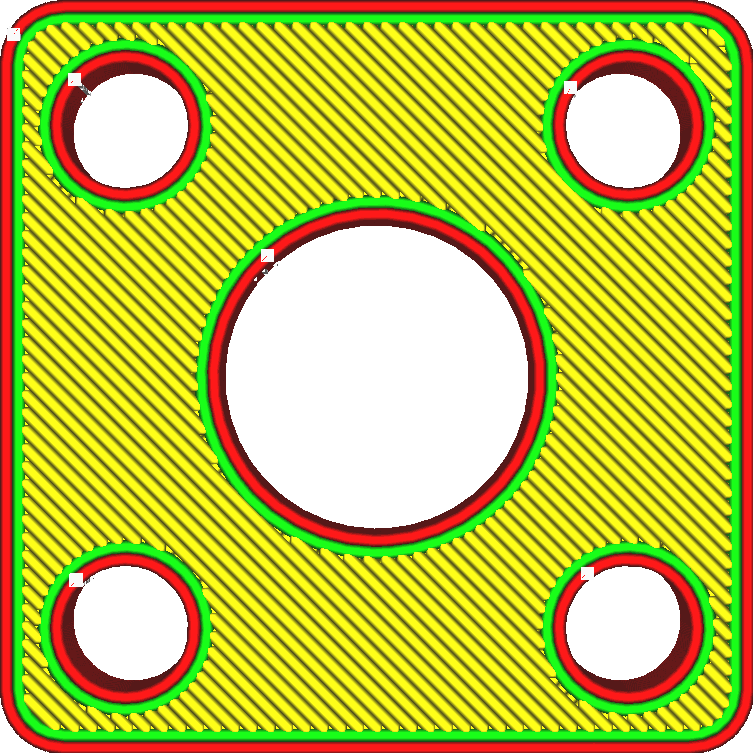

Porcentagem de sobreposição da camada externa
====
Esse ajuste significa que a pele monta um pouco as estruturas adjacentes.A pele segue melhor essas estruturas.

A sobreposição nesse ajuste é expressa como uma porcentagem da largura média das linhas entre as linhas da pele e as linhas da parede mais interior.

Essa sobreposição produz tecnicamente uma superextrusão, mas a quantidade de superextrusão é baixa o suficiente para que seja visível.No entanto, isso terá uma influência significativa na resistência, porque a pele pode aderir melhor às paredes e ao preenchimento.Afinal, essas estruturas apenas aumentam a solidez do modelo se tiverem algo para aguentar.

Ter um pouco de sobreposição também pode ajudar a reduzir a aparência de lacunas na pele.