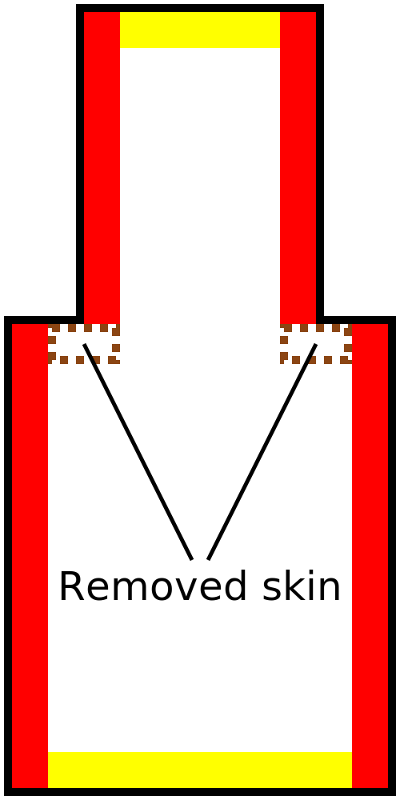

Remoção de largura da camada externa
====
Essa configuração possibilita remover tiras muito finas da pele e substituí -las pelo recheio.

A pele só será removida se houver um recheio ao lado dela, para que a pele normalmente não seja removida na parte superior ou na parte inferior da sua marca, mesmo que esteja muito bem.

A pele é normalmente gerada em qualquer lugar que esteja verticalmente perto da parte superior ou inferior do objeto.Isso não é necessário em qualquer lugar.As paredes verticais geralmente são bastante sólidas; portanto, quando normalmente deve ser a pele ao lado das paredes verticais, esse ajuste permite omitir.Isso economiza tempo e material de impressão.

Se a configuração estiver muito alta, os espaços poderão aparecer nas superfícies superior e inferior onde o enchimento é exposto.Preste atenção especial aos modelos com bordas finas que devem ter uma tira fina de pele.

O recheio também pode ser visto à vista por camadas