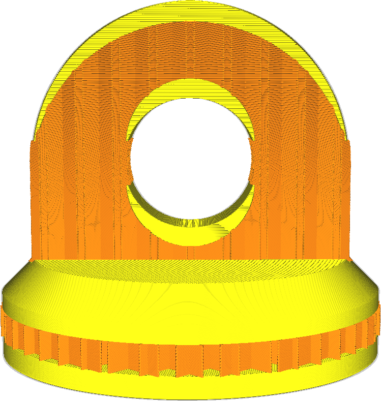

Topo/abaixo
====
Com a espessura superior/inferior, você pode ajustar a espessura da pele sólida criada nos lados superior e inferior da impressão.

Isso diz respeito às faces de impressão superior e inferior.A parte superior e a parte inferior também podem ser configuradas individualmente com os parâmetros [espessura superior](top_thickness.md) e [espessura do abaixo](Bottom_thickness.md).

Se esse parâmetro não for um múltiplo da altura da camada, ele será arredondado para o múltiplo mais próximo.Este parâmetro determina apenas o número de camadas superior e inferior que serão geradas.

Uma espessura mais alta e mais baixa terá vários efeitos, benéficos para a qualidade total, mas prejudicial à produtividade.
* Seu quarto será mais sólido.Uma espessura mais alta e mais baixa significa que uma parte menor da sua impressão será preenchida pelo padrão de enchimento disperso.Em vez disso, será completamente preenchido.
* A superfície superior será mais suave.As almofadas e os quedas da pele superior serão achatados nas camadas superiores.
* É mais provável que seu modelo seja à prova d'água.Nos lados superior e inferior, haverá mais camadas para impedir que a água ou outros fluidos penetrassem e recuperem as saliências de flutuação.
* Sua pegada usará mais material, à medida que mais fraldas estão totalmente preenchidas.
* Sua impressão levará mais tempo, porque será necessário colocar mais material e essas camadas são normalmente impressas mais lentamente do que o preenchimento.