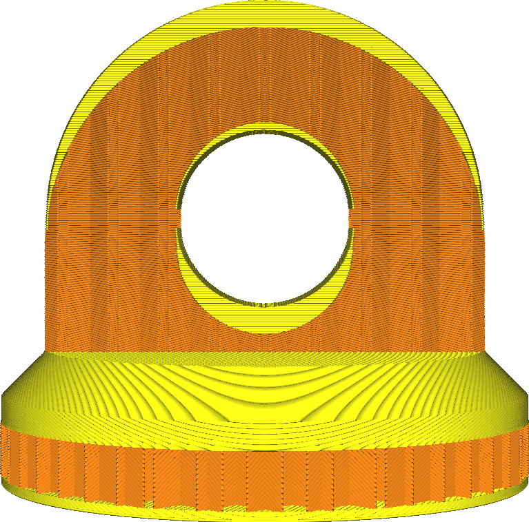

Espessura superior
====
Este parâmetro permite que a espessura da face superior cheia de impressão seja configurada.Esta camada completa é impressa em vez de recheio esparso.Pretende fechar o lado superior.

Um lado superior mais espesso terá vários efeitos, benéficos para a qualidade da superfície superior, mas prejudicial à produtividade.
* Seu quarto será mais sólido.Um lado superior mais espesso significa que uma parte menor da sua impressão será preenchida pelo padrão de enchimento disperso.Em vez disso, será completamente preenchido.
* A superfície superior será mais suave.O efeito do colchão e os quedas da pele superior serão achatados nas camadas adicionais.
* É mais provável que seu modelo seja à prova d'água.Um lado superior mais grosso fornecerá mais camadas para impedir que a água ou outros fluidos penetrantes, uma vez que mais camadas estão totalmente preenchidas.
* Sua impressão usará mais material, à medida que mais fraldas estão totalmente preenchidas.
* Sua impressão levará mais tempo, porque é necessário colocar mais material e essas camadas são normalmente impressas mais lentamente do que o preenchimento.