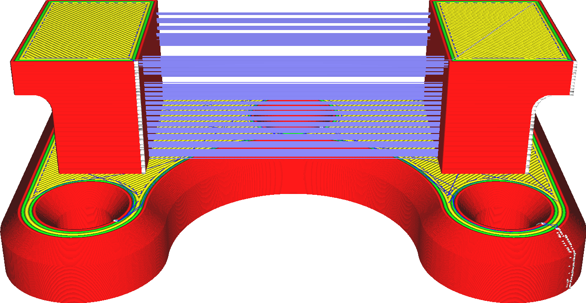

Ative a retração
====
Se uma impressora 3D parasse de empurrar o material, o material não cessaria imediatamente para fluir pelo final do bico.Existem resíduos de matéria no bico e é pressurizado, o que faz com que ele continue fluindo por um tempo.Para impedir que o material flua, a impressora deve removê -lo da abertura do bico.Isso é necessário para executar movimentos de deslocamento limpo sem fio.

As retrações são feitas durante um deslocamento particularmente sensível à geração de fios.Os movimentos do movimento que apenas passam por um recheio ou suporte para suporte de suporte são normalmente retraídos.Há também um limite para a frequência do material do material, através de parâmetros [número de retração máxima](retração_count_max.md) e [intervalo de distância mínima de extrusão](retraction_extrusion_window.md).

A retração tem vantagens significativas, mas também desvantagens:
* Reduz consideravelmente o número de filhos.Não há mais sequência entre as diferentes partes da impressão.
* Isso reduzirá significativamente a quantidade e o tamanho das marcas na superfície, onde o bico penetra no perímetro de uma sala.
* Leva um pouco de tempo para se retrair.
* O fluxo de material é interrompido quando há retração.Isso tem consequências negativas na precisão dimensional, arranhões e subestriões.
* O filamento pode se desgastar quando há muitas retrações, o que impede que a fonte de alimentação empurre o material.

** Os materiais flexíveis são mais difíceis de se retrair, porque disparar o filamento o estica em vez de tirá -lo do bico.Pode ser muito longo e relativamente ineficaz permitir a retração com esses materiais. **

