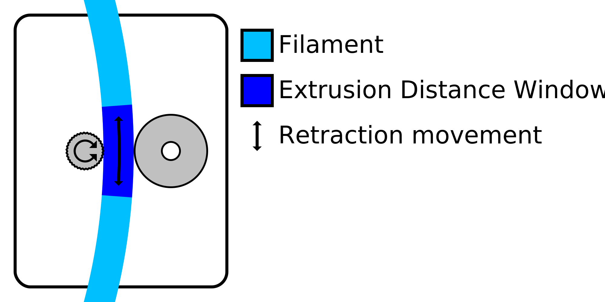

Intervalo de distância de extrusão mínima
====
A roda elétrica deve pegar o filamento para movê -lo corretamente.A retração do material geralmente tende a usar o filamento a ponto de a roda de alimentação não poder mais segurá -lo corretamente.Esse ajuste limita o número de retrações a um certo comprimento de filamento para evitar essa moagem.

As retrações são limitadas pela combinação de [número máximo de retração](retração_count_max.md) e esse ajuste.O material não pode ser retraído mais do que o valor da retração máxima em um comprimento de filamento indicado por esse ajuste da janela de distância mínima de extrusão.

O comprimento do filamento durante o qual o número de retrações é limitado é uma janela deslizante.Por exemplo, com um comprimento de janela de 3 mm e um número máximo de retrações de 10, isso significa que uma nova retração é autorizada assim que a 10ª retração anterior foi feita mais de 3 mm de volta ao filamento.

O aumento no comprimento da janela de extrusão permite reduzir efetivamente o número de retrações.Isso torna a impressão mais confiável, mas aumenta a quantidade de filamentos e manchas na superfície.Isso é particularmente útil para mais materiais macios que são mais sensíveis à moagem.