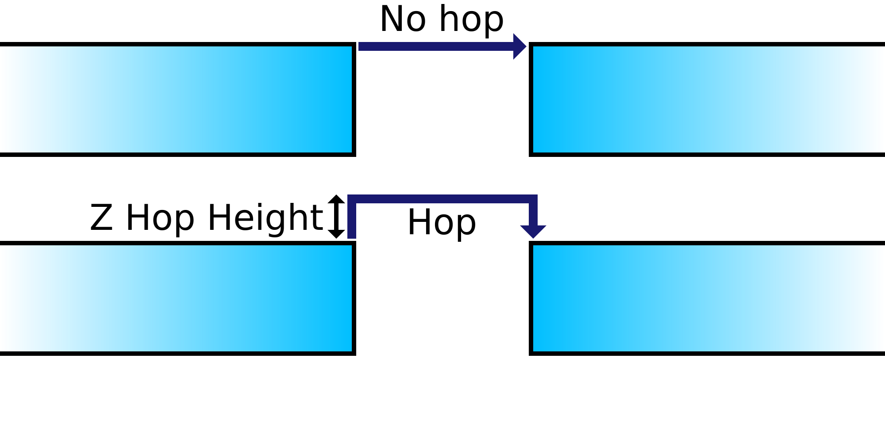

Z Offset durante uma retração
====
Se essa configuração for ativada, o bico será ligeiramente elevado acima da impressão quando o bico é mover de um lugar para outro.O objetivo é que o bico passa acima da impressão em vez de esfregar as peças anteriormente impressas com o bico.

Sempre que uma retirada é feita, o bico é observado (ou a bandeja de impressão abaixada) para criar um espaço entre o bico e a impressão.Isso tem várias vantagens:
* Impede que o bico atinja a impressão durante a viagem.Quando o bico esfrega a impressão, deixa uma cicatriz visível, o que deve melhorar a qualidade visual das paredes de impressão.
* Se as vazamentos do bico durante as viagens, o exsudato será depositado no local onde o bico surgir após a viagem, geralmente no recheio onde não é visível.Isso reduz defeitos na superfície.
* Os falhas na superfície têm a chance de reduzir sua impressão; portanto, ativar esse parâmetro pode melhorar a confiabilidade da impressão.

No entanto, mover o bico de cima para baixo leva um pouco mais de tempo, para que sua impressão seja mais longa para fazer.O eixo Z da impressora também pode se desgastar mais rápido, dependendo do design da impressora.