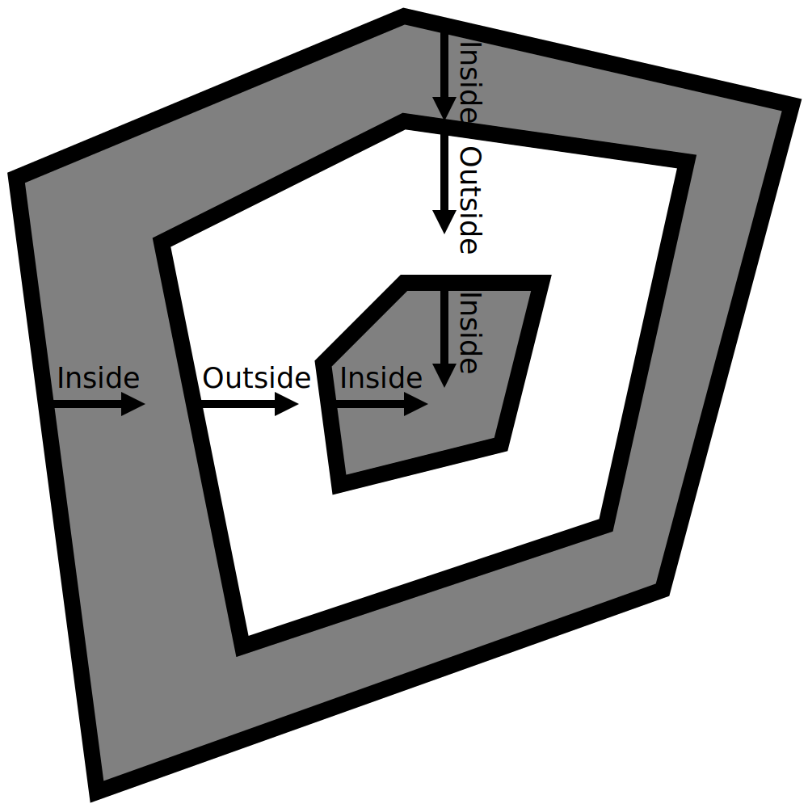
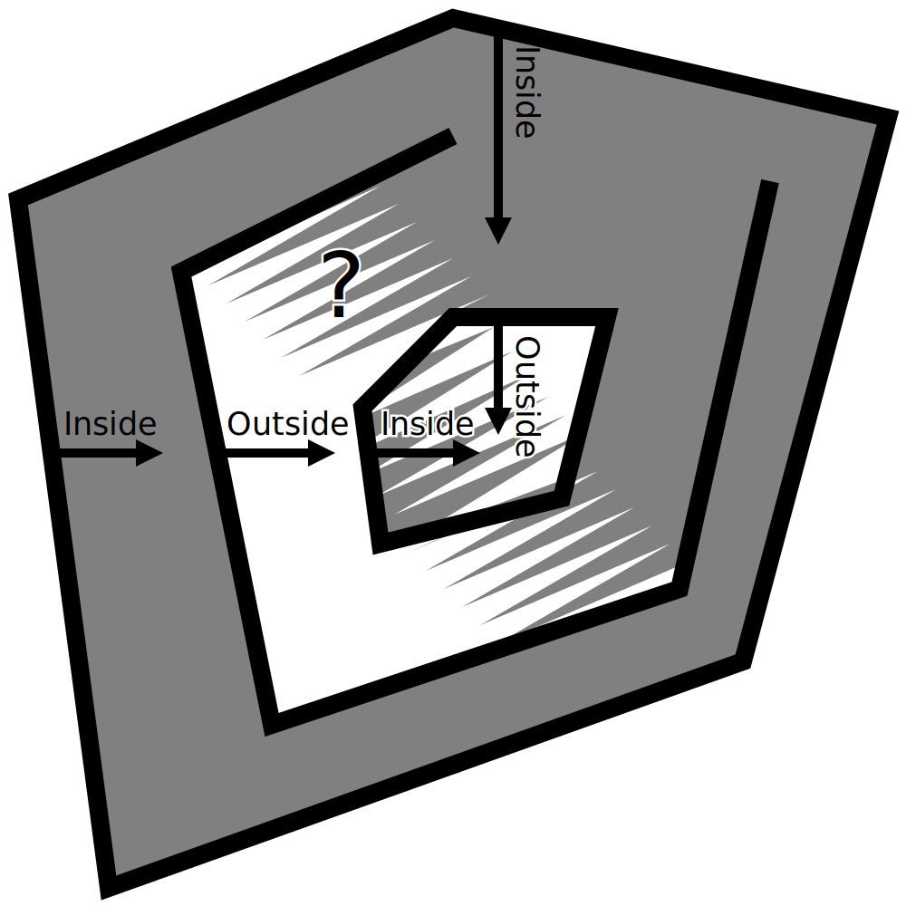

Buracos no modelo
====
Às vezes, quando a inspeção da visão da camada (ou se você tiver azar, durante a impressão), parece que certas partes da impressão estão faltando.Isso pode ter vários motivos.Este artigo lista algumas possibilidades.

Pontos não -gerentes
----
Alguns pontos têm orifícios em sua superfície ou geometria adicional dentro.Isso deixa a cura confusa, porque não sabemos mais claramente quais partes do volume pertencem ao interior e a quais partes não pertencem a ele.O Cura pega uma seção transversal da malha com cada camada e assume que ela encontrará cachos fechados.Se não houver loops fechados ou se houver superfícies adicionais, além desses loops fechados, normalmente não serão impressos.Portanto, se houver um orifício no modelo, as seções transversais não serão fechadas e as camadas onde esse furo existe não serão impressas.As malhas que contêm esses orifícios ou geometria adicional são chamadas [não manifold](https://en.wikipedia.org/wiki/manifold) porque não podiam existir no mundo real.

Se a malha não for múltipla, geralmente você pode vê -la inserindo a fase de preparação e selecionando a visualização da raio -x. A visualização da raio -x colorirá algumas peças em vermelho se você olhar através de um número ímpar de superfícies, que ocorre quando o malha não é múltipla.Dessa forma, você pode identificar os problemas da sua rede.Você precisará reparar essas malhas em um aplicativo CAD ou de modelagem.

Embora o Cura normalmente assuma que a malha é múltipla, ela pode reparar o modelo em alguns casos.Aqui estão alguns exemplos do que você pode tentar:
* O [Mending](../Meshfix/Meshfix_extension_stitching.md) gerencia os casos em que há uma geometria adicional conectada fora de um modelo, embora demore um pouco mais para cortar.
* [Mantenha as faces discoint](../meshfix/meshfix_keep_open_polygons.md) fechará todos os cachos abertos com uma linha reta.Isso permite que você feche pequenos espaços.No entanto, isso também pode dar um aspecto muito estranho ao modelo se tiver grandes espaços.
* Como último recurso, o [modo de superfície](../Blackmagic/Magic_Mesh_surface_mode.mode) pode ser usado para imprimir peças do buraco como uma parede simples, sem qualquer conteúdo.Como não sabemos onde está o interior desta parte, não haverá preenchimento ou pele, mas pelo menos o contorno pode ser desenhado.Em alguns casos, isso pode dar a impressão de que a impressão ainda é aceitável.

Se essas opções não permitirem que você obtenha a impressão desejada, você precisará repará -las manualmente usando aplicativos de modelagem 3D.

Peças finas
----
Se o modelo tiver detalhes muito finos, tudo não poderá ser desenhado com as linhas grossas que saem da sua impressora 3D.Cura ajustará as linhas dentro da forma definida pela sua malha.Se isso não for possível, nada será impresso.Nesse caso, pode parecer que há partes da impressão.

É possível remediar esse problema de várias maneiras:
* Reduza a [largura da linha](../Resolução/line_width.md).Se você imprimir algo que tenha paredes ou faixas finas, verifique se a largura da linha é um pouco menor que a largura mínima desta parte.No entanto, uma redução excessiva na largura da linha pode causar [subestimação](subrextrusion.md) devido a um fluxo insuficiente.Para poder reduzir ainda mais a largura da linha, você precisará usar um bico menor.
* Adicione um pouco de [expansão horizontal](../shell/xy_offset.md) à impressão.Isso torna todo o modelo mais largo por todos os lados, incluindo peças finas.Eles ficam menos magros dessa maneira, para que agora possam ser impressos.Obviamente, isso também arruina a precisão dimensional e os detalhes da impressão, porque tudo se torna mais espesso.
* Ative o parâmetro [Imprima paredes finas](../shell/FILL_OUTLINE_GAPS.MD).Isso tentará preencher as peças finas com linhas muito pequenas sem reduzir a largura da linha do restante do modelo.No entanto, isso causa grandes mudanças no fluxo do material e nem sempre pode encher as paredes com belas linhas regulares.
* Lembre -se de adaptar o modelo à impressão, garantindo que cada sala seja pelo menos tão espessa quanto a largura da sua linha.