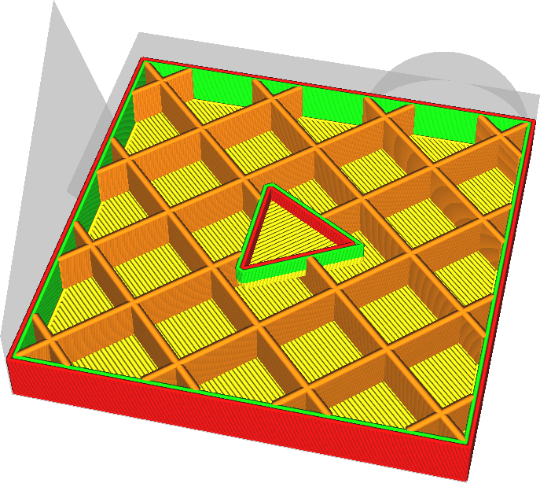

Ширина линии заполнения
----
Данный параметр отвечает за ширину лини заполнения. Также как и другие параметры ширины линий, настройка может быть изменена от номинала диаметра сопла. Если увеличить параметр, линии экструдирования будут толстыми. Если сделать ширину линий меньше, то возникнет эффект поверхностного натяжения, а сам материал будет ложиться равномерно.

Увеличении ширины линии заполнения является простым способом сокращения времени печати. Слишком большая ширина линии может привезти к "затору материала", поток филамента не сможет экструдироваться полностью, что приведет к недоэкструзии.

**Линии заполнения могут оказаться гораздо шире, чем указаны в данном параметре.Это произойдет потому, что за настройку отвечает еще один параметр [Толщина слоя заполнения](../../../articles/infill/infill_sparse_thickness.md).**