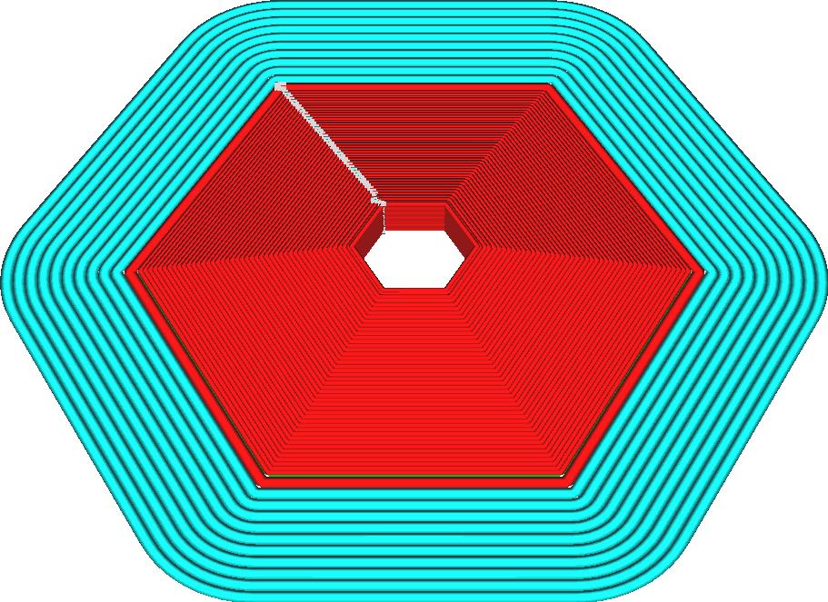

Ширина линии первого слоя
====
Этот параметр делает ширину линии начального слоя тоньше или больше.

Цель данного параметра - улучшение адгезии с поверхностью стола. Толстые линии имеют большую площадь, поэтому материал будет сцепляться со столом намного эффективнее.
* Линии не просто будут тоньше или толще, но и расстояние будет между ними пропорционально уменьшаться или увеличивается. Так что изменение этого параметра никак не повлияет на недоэкструзию или наоборот переэкструзию
* Данный параметр влияет на все типы линий первого слоя, включая линии стен, дна, поддержки, черновой башни и т.д.