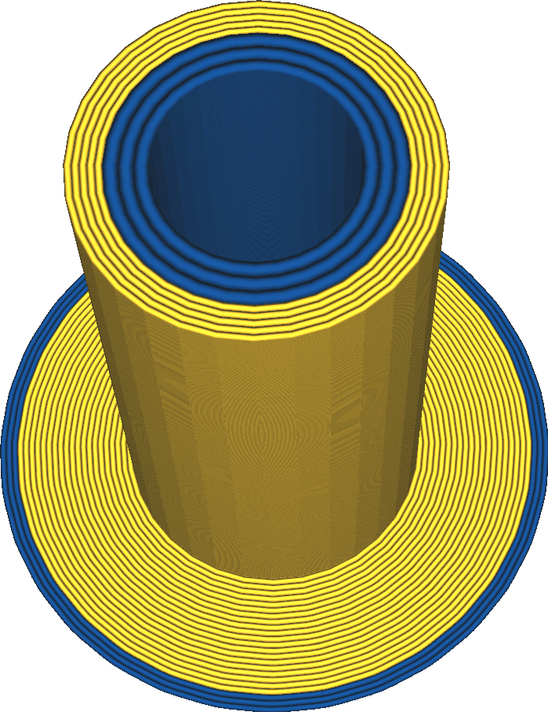

Ширина линии черновой башни
----
Данная настройка отвечает за ширину линии черновой башни

Более толстые линии черновой башни приводит к тому что печать идет немного быстрее. Если сделать сделать ширину линии чуть больше, то можно избавиться от большого количества контуров черновой башни.

Слишком сильное увеличение ширины линии может сделать черновую башню хлипкой из-за недостаточности экструдирования материала.