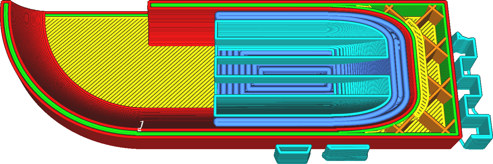

Данный параметр регулирует ширину линий дна поддержки.

Тонкие линии дна поддержки уменьшают адгезию с поверхностью, но в целом адгезии поддержек хватает чтобы оставались надежными на протяжении всей печати. Кроме того тонкие поддержки облегчают их удаление, оставляя как можно меньше дефектов на поверхность деталей.

И чем тоньше поддержка, тем больше времени нужно на ее построение.