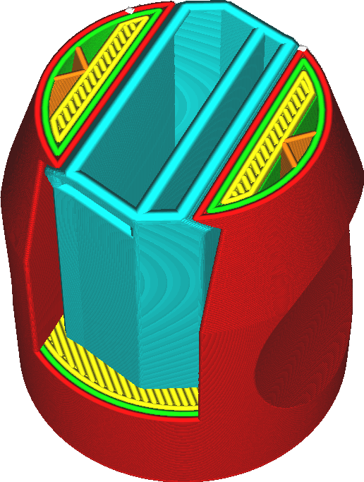

Ширина линии поддержки
====
Данный параметр отвечает за общую ширину линии поддержки.

Как правило поддержки не нуждаются в эстетичности, да и точность большая им тоже не к чему. Можно сделать поддержки толще и сэкономить время на печати. Но такие поддержки стабильны, но их тяжело снять не навредив основной детали.

Основная задача поддержек - не дать нависающим частям детали плохо напечататься. Но и при этом печататься поддержка должна таким образом, чтобы потом можно было ее удалить нанесения ущерба основной детали.