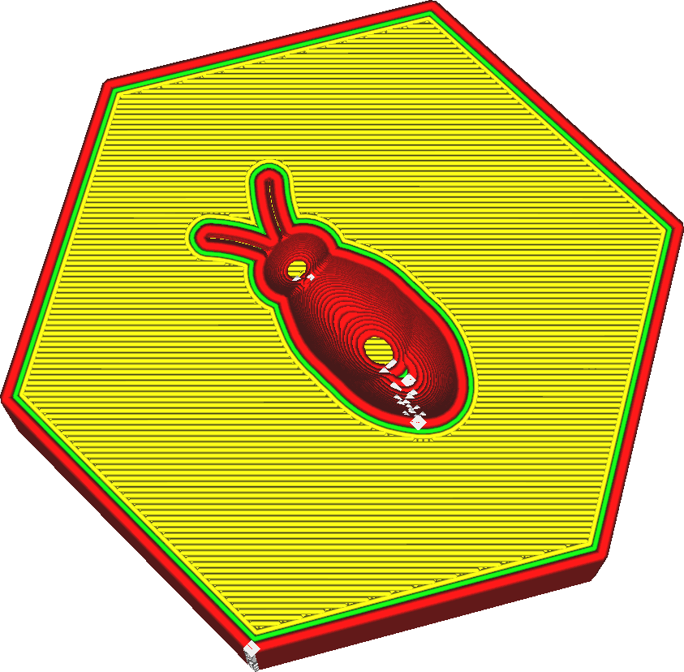

Ширина линии внешней стенки
====
Ширина линии внешних стен может регулироваться отдельно от внутренних. Данный параметр указывает на то, насколько широкой будет линия внешнее стенки

Уменьшение линии наружной стенки до ширины линии меньше диаметра сопла улучшает печать и благоприятно сказывается на прочности детали. Сопло будет выдавливать чуть меньше материала, но отверстие сопла будет перекрывать смежные линии внутренней стенки. Так уложенный материал внешней стенки будет немного подвигать материал внутренней, тем самым это улучшит сцепляемость линий друг с другом. Такой подход делает печать более прочной, а стенки становятся монолитнее

Уменьшение ширины внешней стенки позволяет печатать более мелкие объекты. Тонкая экструдированная линия будет лучше вписываться в геометрию детали

Увеличение ширины внешней стенки лучшим образом сказывается на времени печати. Чем шире будет стена, тем меньше проходов будет делать сопло на каждом слое. Правда расплачиваться за это придется прочностью деталей, поскольку стенки уже не так  хорошо будут спекаться между собой.

Создание правильных линий
----
При печати деталей с тонкими стенками, если вы хотите получить прочную деталь, крайне важно подобрать оптимальный параметр. Программа Cura всегда рисует полные контуры линий, но если настройки будут неправильно выставлены, может образоваться зазор между соседними линиями. Это сильно снизит прочностные характеристики и точность изготовления детали тоже пострадает

Cura попытается заполнить промежутки между стенами, если параметр [Заполнение между стенками](../../../articles/shell/fill_perimeter_gaps.md) будет включен. Этот метод не является идеальным решением и занимает много времени печати, особенно если эта делать сложной формы.

Может получиться так, что программа создаст стенки которые будут перекрывать друг друга, но при печати количество подаваемого пластика будет одинаковым, даже если в этом месте материал уложен.  В этом случае поможет активированная настройка [Компенсация перекрытия стен](../../../articles/shell/travel_compensate_overlapping_walls_enabled.md) которая уменьшит ширину линий и обеспечит точность детали. Но этот параметр тоже не является идеальным решением и вызывает снижение качества и прочность детали.

Лучше всего подбирать ширину линии таким образом, чтобы суммарная ширина стены объекта соответствовал множителю ширины линии стенки. Лучше заранее проектировать детали учитывая ширину экструзии.  

Проектировка детали должна происходить так, чтобы стенка детали была кратного размера настройки ширины линии. Важно помнить, что вы всегда можете использовать настройки [Ширина линии внешней стенки](../resolution/wall_line_width_0.md) и [Ширина линии внутренней стенки](../resolution/wall_line_width_x.md) по отдельности чтобы добиться лучшего заполнения стен.  Изучите внимательно параметры, и сколько раз будет нарисован тот или иной контур чтобы всегда держать ситуацию под контролем.

Подбор линии стен - это еще один полезный параметр. Опытный специалист в 3D печати не должен пренебрегать такими важными настройками.